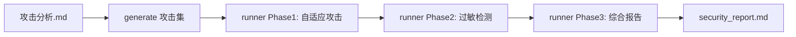

# LLM API 安全性评估系统

一个系统化的黑盒 LLM 安全评估框架：自动生成攻击集 → 自适应攻击测试 → ELO 威胁排名 → SVD-Ridge 批量预测 → 过敏检测 → 聚类分析 → 生成可读的 Markdown 安全报告。

## 快速开始

### 1. 安装依赖

```bash
pip install -r llmsec/requirements.txt
```

### 2. 配置环境

在 `llmsec/.env` 中填入目标模型与生成模型配置：

```env
TARGET_TYPE=openai
TARGET_API_KEY=sk-yyy
TARGET_BASE_URL=https://api.deepseek.com/v1
TARGET_MODEL=deepseek-v4-flash

GENERATOR_API_KEY=sk-xxx
GENERATOR_BASE_URL=https://api.deepseek.com/v1
GENERATOR_MODEL=deepseek-v4-flash

JUDGE_MODEL=deepseek-v4-flash
```

### 3. 三步跑通

```bash
# 步骤 1：生成攻击集（从 llmsec/攻击分析.md 提取 L1 方法）
python -m llmsec.attacks.generate --output output/attacks/l1.jsonl

# 步骤 2：自适应攻击 + 过敏检测 + 综合报告（主入口）
python -m llmsec.pipeline.runner --input attacks/l1.jsonl --max-rounds 10 --batch-size 10

# 步骤 3：查看报告
cat llmsec/output/runs/<时间戳>/security_report.md
```

**无真实 LLM 离线测试**：

```bash
# 终端 1：启动本地模拟模型
python -m llmsec.server.local_model_server --port 8000

# 终端 2：用 local_sim 模式跑 runner
TARGET_TYPE=local_sim TARGET_BASE_URL=http://127.0.0.1:8000/v1 \
  python -m llmsec.pipeline.runner --input attacks/l1.jsonl --max-rounds 5
```

---

## 核心概念

### 反向 ELO

攻击方法是进攻方，目标模型是防守方。攻击成功 → 攻击方法 ELO 上升；被防住 → 下降。防守方 ELO 就是"安全边界"，ELO 越高的攻击方法威胁越大。

### SVD-Ridge 批量预测（冷启动核心）

未测方法的初始 Elo 不再逐个计算，而是**一次性矩阵运算**：

- **特征矩阵**：每个攻击方法由 5 块特征组成向量——文本结构（15 维）、语义 embedding（PCA 降维）、攻击技术多标签、意图与对抗强度、先验特征（9 维：变体后缀 one-hot、数学越狱税标记、方法名统计等）。所有方法连起来就是一个特征矩阵 X。
- **模型**：用已测方法的 X 和真实 Elo y 训练 Ridge 回归。对 X 做 SVD 分解 `X = UΣV^T`，Ridge 解 `w(λ) = V(Σ² + λI)⁻¹ΣU^Ty`，一次前向传播 `E = y_mean + X_test @ w` 得到全部未测方法的预测 Elo。
- **λ 选择**：K-Fold（K=5）交叉验证在正则化路径 λ ∈ logspace(-3, 4, 24) 上选最优 λ。
- **MAP 不确定性**：Ridge 等价于高斯先验的贝叶斯 MAP，每个预测附带方差 `σ²·diag(X(XᵀX + λI)⁻¹Xᵀ)` 与 95% 置信区间，作为评估指标输出并持久化。
- **主成分诊断**：SVD 顺便产出奇异值谱、解释方差比与有效自由度 df(λ)，量化降维效果（因此可以加入更多先验特征而不增加过多负担）。
- **模型缓存**：ground truth 未变 → 直接复用 w 纯矩阵预测；小幅增长 → 用现有 λ* 单次 SVD 快速 refit；增长 ≥ 阈值 → 才重跑 K-Fold。每轮只调整预测矩阵，开销最小。
- **回退链**：ground truth 不足时，回退到同后缀/同基底变体（如 `*_rot13`、`*_b64`）的简单平均。

### 固定簇 + 动态重训练

攻击开始前预聚类固定簇结构，攻击过程中簇不变；启动时优先复用已有 `cluster_artifacts`，只在攻击集变化、ground truth 显著增长或强制要求时才重新训练。最终聚类在攻击完成后基于全部真实数据运行一次。

### 抗假阳性收敛

防御方 ELO 收敛必须同时满足：轮次 Elo 标准差小、相对标准差小、已测覆盖率足够、轮次足够。轮次不足时仍输出统计量（单点标准差按阈值保守处理，避免过早假收敛），置信度按轮次折扣并在 notes 中说明。置信度权重：绝对标准差 0.30 + 相对标准差 0.35 + 覆盖率 0.20 + 轮次 0.15，封顶 0.99。

### 自适应攻击频率

batch_size 不再固定。系统根据最近轮次防御方 ELO 的标准差动态调整：波动大时减小 batch 做精细探索，稳定时增大 batch 加速覆盖，收敛更快且更稳定。

### ASR + FPR 二维画像

- **ASR**（攻击成功率）：衡量防线强度
- **FPR**（误杀率）：用"安全孪生"（语义安全但结构相似的 prompt）测试模型是否误伤正常请求

### 越狱税（Jailbreak Tax）

攻击 prompt 中嵌入数学题，目标模型需以 `[MATH:答案]` 格式作答。越狱成功后若数学推理退化，说明模型为"配合"付出了能力代价。

---

## 典型工作流

### 完整评估流程



1. **攻击生成**：`python -m llmsec.attacks.generate` 从 `llmsec/攻击分析.md` 解析 L1 方法，生成带数学题的攻击 prompt。
2. **自适应攻击**：`runner` 用 ELO 驱动逐轮攻击。种子阶段每个预簇随机测 1 个方法建立 ground truth；随后 SVD-Ridge 批量预测所有未测方法的初始 Elo；后续轮次用采样器选择下一批方法，并根据 ELO 波动自适应调整 batch_size，直到收敛或达到最大轮次。
3. **过敏检测**：在 ELO 边界附近选取方法，用安全孪生测试模型是否过敏，计算 FPR。
4. **综合报告**：合并 ASR + FPR + ELO 边界，输出 `runner_report.json` 和 `security_report.md`。

### 数据流向

- **输入**：`output/attacks/l1.jsonl`（攻击集）
- **状态**：`output/state/state.json`（ELO + ground truth + 预测不确定性）
- **聚类**：`output/cluster_artifacts.pkl`、`cluster_report.json`
- **输出**：`output/runs/<时间戳>/` 下的报告与日志

---

## 目录结构

```
llmsec/
├── core/         # 配置(.env加载/路径常量)、日志、JSONL IO、LLM客户端重试
├── targets/      # 目标模型后端路由: openai / local_sim / pcap_judge (TARGET_TYPE)
├── evaluation/   # evaluator(全量评估) / judge(LLM评分) / elo(反向ELO)
│                 # elo_cluster(SVD-Ridge批量预测) / cluster_analysis(簇级分析+模型诊断)
│                 # safe_twin(过敏检测)
├── attacks/      # generate(L1攻击生成) / harmbench(HarmBench攻击集生成)
├── pipeline/     # runner(自适应编排) / launcher(交互启动器) / probe(连通性探测)
├── reporting/    # report(五维树形画像 + LLM叙事报告 + 方法注册表)
├── clustering/   # 特征提取 + hdbscan/kmeans/hierarchical 聚类 + CLI
└── server/       # local_model_server(本地模拟模型, OpenAI兼容)
```

---

## 安装与配置

### 依赖

Python 3.11。其中 `hdbscan`、`sentence-transformers`、`tiktoken` 为聚类模块的可选/惰性依赖。

### 环境变量

| 变量 | 说明 | 默认 |
|---|---|---|
| `TARGET_TYPE` | 目标后端：`openai` / `local_sim` / `pcap_judge` | `openai` |
| `TARGET_API_KEY` | 目标模型 API Key | - |
| `TARGET_BASE_URL` | 目标模型地址 | `https://api.deepseek.com/v1` |
| `TARGET_MODEL` | 目标模型名（`pcap_judge` 模式下防御方名称自动使用 `PCAP_MODEL_VERSION`） | `deepseek-v4-flash` |
| `GENERATOR_API_KEY` | 攻击生成/安全孪生/报告叙事 API Key | - |
| `GENERATOR_BASE_URL` | 生成模型地址 | `https://api.deepseek.com/v1` |
| `GENERATOR_MODEL` | 生成模型名 | `deepseek-v4-flash` |
| `JUDGE_MODEL` | Judge 模型名（缺省回退 GENERATOR） | `deepseek-v4-flash` |
| `EMBEDDING_MODEL` | 聚类语义嵌入模型 | `all-MiniLM-L6-v2` |
| `PCAP_JUDGE_URL` | PCAP Judge 地址（TARGET_TYPE=pcap_judge 时） | - |

---

## 命令参考

### 攻击生成

```bash
python -m llmsec.attacks.generate [--dry-run] [--only ID] [--start-from ID] [--output PATH]
    # 解析 llmsec/攻击分析.md 中的 L1 攻击方法

python -m llmsec.attacks.harmbench [--max N] [--seed N]
    # 生成 HarmBench 攻击集（默认 output/attacks/harmbench_jailbreak.jsonl）
```

### 自适应评估（主入口）

```bash
python -m llmsec.pipeline.runner [--phase {all,1,2}] [--input FILE] [--batch-size N]
                                 [--max-rounds N] [--twin-window N]
                                 [--cluster-retrain-threshold N]
                                 [--cluster-retrain-force]
                                 [--sampler {gap,infogain,coordinate,hybrid}]
                                 [--sampler-alpha A] [--sampler-beta B] [--sampler-gamma G]
                                 [--coordinate-rounds R]
```

- `--phase`：`all`（攻击+过敏）、`1`（仅攻击）、`2`（仅过敏）
- `--input`：攻击集路径，相对 `output/` 目录
- `--twin-window`：过敏检测方法数；未指定时按 ELO 边界置信度自适应
- `--cluster-retrain-threshold`：新增多少 ground truth 后触发聚类重训练（默认 10）
- `--cluster-retrain-force`：强制在本次运行开始时重训练聚类模型
- `--sampler`：采样策略
  - `gap`：按 |攻击ELO - 防御ELO| 最小选择
  - `infogain`：全局信息增益（不确定性 + 簇覆盖 + 成功潜力）
  - `coordinate`：簇坐标下降（外层轮询簇，内层选边界附近方法）
  - `hybrid`：前 R 轮 InfoGain + 后接 Coordinate（默认）
- batch_size 会根据 ELO 波动自适应调整：波动大时减小（更精细探索），稳定时增大（加速覆盖）

### 辅助命令

```bash
python -m llmsec.evaluation.evaluator [--input attacks/l1.jsonl] [--max-samples N] [--repeat N]
                                      [--only ID] [--start-from ID] [--no-judge]
    # 全量评估：逐条发送目标 → Judge 评分 → 更新 ELO（不跑自适应采样）

python -m llmsec.evaluation.cluster_analysis [--defender NAME] [--output PATH]
    # 基于当前 ELO 与聚类结果输出簇级安全分析
    # 含 SVD-Ridge 模型诊断：正则化路径、最优 λ、主成分分析、特征重要性、预测置信区间

python -m llmsec.evaluation.elo_cluster --status
    # 查看聚类-ELO 预测器状态

python -m llmsec.evaluation.safe_twin [--generate|--evaluate|--all]
    # 安全孪生生成与过敏（FPR）检测

python -m llmsec.clustering.cli [--method {hdbscan,kmeans,hierarchical}] [--k N]
                                [--min-cluster-size N] [--weights emb,tech,intent,defense]
    # 攻击方法聚类分析

python -m llmsec.reporting.report [--output-dir DIR]
    # 独立生成报告：扫描 *_结果.jsonl 和最新 runs/ 的 attack_results.jsonl

python -m llmsec.pipeline.launcher
    # 交互式启动器：选择攻击集与模式后引导执行

python -m llmsec.pipeline.probe [--text "测试文本"]
    # 目标 API 连通性探测
```

### 测试

```bash
python -m tests.clustering_kdistance
    # 离线验证聚类效果：构造 base64/rot13/code 三类攻击，断言簇数 ≥3 且噪声比 <30%

python -m tests.test_elo_convergence
    # 回归测试：验证 predict 变体兜底与 check_convergence 抗假阳性

python -m tests.test_svd_ridge
    # 回归测试：PCAP 防御方名称、SVD-Ridge 批量预测精度（含截距/RMSE/趋势）、
    # ground truth 不足回退、首轮收敛统计、K-Fold λ 稳定性、模型缓存
```

---

## 输出文件布局

```
llmsec/output/
├── attacks/                # 攻击集（l1.jsonl、harmbench_jailbreak.jsonl）
├── state/                  # 持久化状态
│   ├── state.json          #   统一 ELO + ground truth + 预测不确定性
│   └── safe_twins.jsonl    #   安全孪生集
├── runs/<时间戳>/          # runner 单次运行产物
│   ├── attack_results.jsonl      # 攻击详情（含响应原文）
│   ├── runner_report.json        # 综合报告
│   ├── allergy.json              # 过敏报告 + 2D 画像
│   ├── sampler_log.jsonl         # 每轮采样器决策日志
│   ├── cluster_security_analysis.json  # 簇级安全分析 + SVD-Ridge 模型诊断
│   ├── security_tree.json        # 五维树形画像
│   └── security_report.md        # LLM 叙事报告（最终交付物）
├── {输入名}_结果.jsonl      # evaluate 逐条结果
├── {输入名}_汇总.json       # evaluate 统计摘要
├── method_registry.json    # 方法注册表（ELO + 聚类标签 + prompt 清单）
├── cluster_report.json     # 聚类报告
├── cluster_matrix.csv      # 方法×特征矩阵
└── cluster_features.json   # --dump-features 导出的特征
```

---

## 许可

GPL
