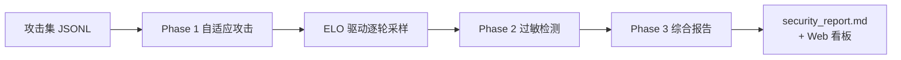

# LLM API 安全性评估系统

> [English](README.en.md) | 中文

一个系统化的黑盒 LLM 安全评估框架：自适应攻击测试 → ELO 威胁排名 → SVD-Ridge / Blend 批量预测 → 过敏检测 → 聚类分析 → 生成可读的 Markdown 安全报告。

> 本项目评估的是**安全评估管线本身**（自适应采样、威胁排名、能力预测、过敏检测、聚类分析），攻击集只是输入耗材。

---

## 它做什么


```mermaid
graph LR
    A[攻击集 JSONL] --> B[Phase 1 自适应攻击]
    B --> C[ELO 驱动逐轮采样]
    C --> D[Phase 2 过敏检测]
    D --> E[Phase 3 综合报告]
    E --> F[security_report.md<br/>+ Web 看板]
```

- **Phase 1 攻击**：用反向 ELO 驱动逐轮挑选攻击方法，Judge 打分实时更新 ELO，直到防御方真值 Elo 的 95% 置信区间收敛。
- **Phase 2 过敏检测**：在 ELO 边界附近用"安全孪生"（语义安全、结构相似的 prompt）测试模型是否误杀正常请求（FPR）。
- **Phase 3 综合报告**：合并 ASR（攻击成功率）+ FPR（误杀率）+ ELO 边界，输出量化安全画像。

---

## 核心架构：R 矩阵是唯一真相

整个评估体系围绕**结果矩阵 R** 构建（`core/results.py`）。R 是唯一不可重算的原始观测，其余皆是派生缓存：

```
R[method][model] = MatchResult         ← 唯一真相（原始观测）
        │
        ├── derive_elo(R, model)       → ELOTracker（ratings / 轨迹 / 收敛）
        │     （evaluation/elo.py，按模型列时序回放，纯函数可随时重算）
        │
        ├── BlendPredictor(R, X)       → 统一 + 模型双层预测（冷启动 Elo）
        │     （evaluation/blend_predictor.py）
        │
        └── 聚类 / 报告 / 看板          → 读 R 派生状态，不直读 state.json
              （经 evaluation/elo_access.py 统一入口）
```

这保证：

1. **Elo 不跨模型混淆** —— 每个模型的 Elo 仅由该模型列回放得到，绝不借用其它模型。
2. **多模型天然支持** —— R 的第二维就是模型；`TARGETS` 环境变量可一次扫描多个目标。
3. **可重建** —— Elo、预测器、收敛判定都能从 R + 方法特征 X 全量重算，缓存丢失无碍。收敛轨迹自轮次编号（`round`）随观测记入 R 的 `extra` 后，`derive_elo` 在 round 于 ts 序单调（单一连贯 run）时按轮用 `update_round`（Model B）回放重建 `_round_defender_elos`；累积/混杂 R 或无 `round` 旧记录则回退逐场 `update`（Model A，确定性、跨 run 安全）。

存储布局（`output/state/`）：`results.json`（R 主存储，权威）+ `elo_cache.json`（派生缓存，可删可重建）。`state.json` 退化为可选快照备份。

---

## 核心概念

### 反向 ELO + K 动力学

攻击方法是进攻方，目标模型是防守方。攻击成功 → 攻击方法 ELO 上升；被防住 → 下降。防守方 ELO 就是"安全边界"，ELO 越高的攻击方法威胁越大。

- **连续成绩映射**：`perf = score/(score+τ)`（饱和），把分数幅度放进结果项而非 K 因子，根治早期 ELO 来回跳。
- **K 衰减**：攻击方用全 K（每法通常只测 1~2 次）；防御方每场必上，`K_def = K / sqrt(max(1, n/N0))`，场次越多评级越稳。
- **同步轮次更新（Model B）+ 批内并行**：一个 round 的全部攻击用**轮始快照** `def_0/K_def` 算 delta（防御方是固定模型，批内攻击是对同一状态的同时独立观测），攻击方各自更新、防御方一次性 `def_0 + Σdelta/√N` 聚合。批内**顺序无关**（Σ 可交换）、消除 batch↔K 耦合；`/√N` 缩放避免 N×全K 求和过冲（蒙特卡洛验证边界误差 ~115→~13，优于逐场）。批内 `evaluate_single` 是纯函数 → 可安全并行求值（`--concurrency`），ELO 仍按轮串行更新，结果与并发度无关。

### 单一 CI 收敛判据

收敛不再是多指标加权，而是把防御方 Elo 轨迹做 OLS，分离**漂移**（朝真值移动）与**噪声**（随机抖动），合成"真值 Elo 的 95%CI 半宽"。收敛当且仅当：

```
ci_half < CONV_CI_TARGET   ∧   |drift| < CONV_DRIFT_TARGET   ∧   覆盖率达标   ∧   轮次足够
```

一个可解释、抗假阳性的停机判据（`evaluation/elo.py:check_convergence`）。

### Blend 双层预测（冷启动）

未测方法的初始 Elo 由预测器给出，自适应混合两层（`evaluation/blend_predictor.py`）：

- **统一预测 P_u**：跨所有模型池化训练，捕获"方法内在威胁"（强越狱对多数模型都强）。新模型冷启动时唯一的先验来源。
- **模型预测 P_m**：仅用该模型列训练，捕获模型特异性弱点。
- **混合** `pred = w_u·P_u + w_m·P_m`，其中 `w_m = n_model/(n_model + K)`：样本少 → 全靠统一（向群体均值收缩）；样本多 → 信任自身。本质是经验贝叶斯收缩，权重随证据自适应增长，无需手调。

底层是 **SVD-Ridge**：用已测方法的特征矩阵 X 和派生 Elo y 训练 Ridge，对 X 做 SVD 分解一次前向传播得到全部未测方法预测；K-Fold 在正则化路径 λ 上选最优；每个预测附带 MAP 不确定性（方差 + 95%CI）。ground truth 未变 → 复用权重纯矩阵预测；增长 → 用现有 λ 快速 refit；大幅增长 → 重跑 K-Fold。

### 统一先验度量空间 + 聚类（post-test）

聚类与预测的距离度量**只使用先验特征**（任何方法都可得：文本结构 + 语义 embedding + 攻击技术 + 意图 + 名称先验），后验特征（defense 交互，未测点全零）一律不进入度量。先 z-score 标准化，再 SVD 降维 + 谱拐点截断噪声尾。

测试结束后用真实机器反应做**弱监督特征加权**（相关方向放大、无关方向压低）。HDBSCAN（EOM）密度聚类，从同一棵可缩放树切出候选 k（`k0 = ceil(log2(n))` 为中心），轮廓系数/CH/DB 合成取全局 argmax 作为关键层。聚类后做 ANOVA / Kruskal-Wallis 后验检验簇效是否显著。

### D-Optimality 主动学习

冷启动种子用贪心 D-optimality：反复选 `xᵀ(XᵀX + λI)⁻¹x` 最大的方法（对预测矩阵信息量最大的方向），每次 Sherman–Morrison 秩1更新信息矩阵（`evaluation/active_learning.py`）。与 Ridge 的 MAP 方差同源。GT 为空时自动退化为最大杠杆点，天然覆盖特征空间。

### 采样器

可插拔的攻击方法采样策略（`evaluation/samplers.py`），目标是最少测试次数收敛到可靠边界：

- `gap`：按 |攻击ELO − 防御ELO| 最小选择
- `infogain`：全局信息增益（分差 + 不确定性 + 簇覆盖 + 成功潜力）
- `coordinate`：簇坐标下降（外层轮询簇，内层选边界附近方法）
- `hybrid`（默认）：前若干轮 InfoGain 快速覆盖，之后切 Coordinate 精细搜索

### ASR + FPR 二维画像

- **ASR**（攻击成功率）：衡量防线强度
- **FPR**（误杀率）：用"安全孪生"测试模型是否误伤正常请求

### 越狱税（Jailbreak Tax）

攻击 prompt 中嵌入数学题（末行以 `[MATH:答案]` 作答）。越狱成功后若数学推理退化，说明模型为"配合"付出了能力代价。

- **价值在于对比**：每次 run 会用裸数学探针（无攻击内容）实测目标的正常正确率（基线），与攻击下正确率对比，`accuracy_drop = 基线 − 攻击下` 才是真实的越狱退化。报告与看板均按 `基线 → 攻击下（退化 x%）` 呈现。
- **哨兵约定**：攻击集记录中 `expected_answer: 0` 表示**该条不测越狱税**——评估时记 `null` 且不影响评分。自带攻击集不写数学题时保持 `expected_answer: 0` 即可。
- **计量**：`math_score` 三档（2=答对、1=答错、0=格式缺失），越狱成功且带探针时从 eval_score 扣 `tax/2`。
- **注意**：探针是生成时注入的静态文本，改动题目难度或模板后必须重新生成攻击集（基线测量是实时的）。

### HPO 实验框架（`experiments/`）

study.yaml 驱动的超参搜索，把 `params.py` 的任意旋钮当因子（经 `LLMSEC_PARAM_<NAME>` 环境变量注入子进程）：

- **策略**：grid / random / bayesian（optuna TPE）
- **断点续跑**：`trials.jsonl` 为真相源，已完成的 config 自动跳过
- **指标**：默认优化 `conv_rounds`（收敛轮次，越小越好），可配置

```bash
python -m llmsec.experiments run <study.yaml>     # 运行/续跑
python -m llmsec.experiments report <name>        # 最佳 config + 对比表
python -m llmsec.experiments trials <name>        # 列出全部 trial
```

> 📚 完整说明（study.yaml 格式、因子类型、搜索策略、度量、隔离与复现）见 [docs/实验框架说明.md](docs/实验框架说明.md)。

> 📚 特征体系、训练/聚类管线、防泄漏审计的完整细节见 [docs/攻击特征与聚类深度研究报告.md](docs/攻击特征与聚类深度研究报告.md)。

---

## 快速开始

### 1. 安装依赖

**方式 A — pip install（推荐）**

```bash
pip install -e .              # 核心（不含聚类，无需下载 torch）
pip install -e ".[cluster]"   # 完整（含聚类特征提取 + embedding 模型）
pip install -e ".[dev]"       # 开发（含测试 + lint）
```

**方式 B — 锁定文件**

```bash
pip install -r llmsec/requirements.txt             # 核心（不含 torch）
pip install -r llmsec/requirements-cluster.txt     # 完整（含聚类 + torch）
```

**方式 C — Docker（一行启动，零安装）**

```bash
# 完整版（含聚类特征提取 + 预缓存 embedding 模型）
docker run -p 8080:8080 -v $(pwd)/.env:/app/.env -v llmsec-data:/app/output jinxiahz/llmsec

# 精简版（不含聚类/torch，仅攻击评估，~500MB）
docker run -p 8080:8080 -v $(pwd)/.env:/app/.env -v llmsec-data:/app/output jinxiahz/llmsec:slim

# 或用 docker compose（自动管理卷 + 重启策略）
docker compose up
```

Python 3.11。`hdbscan`、`sentence-transformers`、`tiktoken` 为聚类模块的可选依赖（安装 `.[cluster]` 时拉入，会附带 `torch` ~2GB；只做攻击评估不需要）。

### 2. 配置环境

复制 `.env.example` 为 `.env`，填入目标模型与生成模型配置。

### 3. 三步跑通

```bash
# 步骤 1：生成攻击集（从 llmsec/攻击分析.md 提取 L1 方法）
python -m llmsec.attacks.generate --output attacks/l1.jsonl

# 步骤 2：自适应攻击 + 过敏检测 + 综合报告（主入口）
llmsec --input attacks/l1.jsonl --max-rounds 10 --batch-size 10
# 或：python -m llmsec.pipeline.runner --input attacks/l1.jsonl --max-rounds 10 --batch-size 10

# 步骤 3：查看报告
cat output/runs/<时间戳>/security_report.md
```

**无真实 LLM 离线测试**：

```bash
# 终端 1：启动本地模拟模型
python -m llmsec.server.local_model_server --port 8000

# 终端 2：用 local_sim 模式跑 runner
TARGET_TYPE=local_sim TARGET_BASE_URL=http://127.0.0.1:8000/v1 \
  python -m llmsec.pipeline.runner --input attacks/l1.jsonl --max-rounds 5
```

---

## 攻击集

**攻击集只是输入耗材**。`llmsec/attacks/` 下的生成器（`攻击分析.md` 解析、内置 HarmBench 数据包装）仅是测试与示范用的样例来源——你完全可以从任何渠道自带攻击集。

> 📚 HarmBench 引用与许可见 [data/Explication.md](data/Explication.md)。

自带攻击集只需满足标准 JSONL 格式（每行一条）：

```json
{"id": "唯一标识", "method": "方法名", "category": "类别", "harm_type": "危害类型", "prompt": "攻击文本", "expected_answer": 0, "source": "自定义来源", "functional_category": "standard"}
```

字段说明：

- `id`：唯一标识（建议 `方法名-序号`）
- `method`：攻击方法名（聚类与 ELO 追踪的键；变体建议 `基底_后缀` 命名，如 `dan_style_rot13`，同基底/同后缀会互相借用预测）
- `category` / `category_name`：攻击类别（可选，默认 `unknown`）
- `harm_type`：危害类型（如 `cybercrime`、`fraud`、`chemical_biological`）
- `prompt`：攻击文本全文
- `expected_answer`：越狱税数学题答案；不用数学税时置 `0`
- `source`：来源标记（可选，默认 `our`）
- `functional_category`：功能类别（可选，默认 `standard`）

放入 `attacks/` 目录后直接运行（也可通过 Web 面板拖拽上传）：

```bash
python -m llmsec.pipeline.runner --input attacks/<你的文件>.jsonl
```

---

## 命令参考

### 攻击生成

```bash
python -m llmsec.attacks.generate [--dry-run] [--only ID] [--start-from ID] [--output PATH]
    # 解析 llmsec/攻击分析.md 中的 L1 攻击方法

python -m llmsec.attacks.harmbench [--max N] [--seed N] [--variants N] [--obfuscate]
                                   [--no-math-tax]
    # 用内置 HarmBench 数据生成示范攻击集，默认输出 attacks/harmbench_jailbreak.jsonl
    # 默认注入越狱税数学探针；--no-math-tax 关闭（PCAP 回放等不答题的后端）
```

### 自适应评估（主入口）

```bash
python -m llmsec.pipeline.runner [--phase {all,1,2}] [--input FILE] [--batch-size N]
                                 [--max-rounds N] [--twin-window N]
                                 [--sampler {gap,infogain,coordinate,hybrid}]
                                 [--sampler-alpha A] [--sampler-beta B] [--sampler-gamma G]
                                 [--coordinate-rounds R] [--target NAME]
```

- `--phase`：`all`（攻击+过敏）、`1`（仅攻击）、`2`（仅过敏）
- `--input`：攻击集路径，相对仓库根目录（如 `attacks/l1.jsonl`）
- `--target`：指定目标模型名（多目标扫描时）
- `--twin-window`：过敏检测方法数；未指定时按 ELO 边界置信度自适应
- `--sampler`：采样策略（见上）

### 实验框架

```bash
python -m llmsec.experiments run <study.yaml>      # 运行/续跑 study
python -m llmsec.experiments report <name>         # 打印最佳 config + 对比表
python -m llmsec.experiments trials <name>         # 列出全部 trial
```

### 辅助命令

```bash
python -m llmsec.evaluation.evaluator [--input attacks/l1.jsonl] [--max-samples N] [--repeat N]
                                      [--only ID] [--start-from ID] [--no-judge]
    # 全量评估：逐条发送目标 → Judge 评分 → 更新 ELO（不跑自适应采样）

python -m llmsec.evaluation.cluster_analysis [--defender NAME] [--output PATH]
    # 基于当前 ELO 与聚类结果输出簇级安全分析
    # 含 SVD-Ridge 模型诊断：正则化路径、最优 λ、主成分分析、特征重要性、预测置信区间

python -m llmsec.evaluation.elo_cluster --status
    # 查看聚类-ELO 预测器状态

python -m llmsec.evaluation.safe_twin [--generate|--evaluate|--all]
    # 安全孪生生成与过敏（FPR）检测

python -m llmsec.clustering.cli [--input FILE] [--result-file FILE] [--dump-features]
    # 攻击方法聚类分析（HDBSCAN + 关键层 auto-k）；
    # --result-file 提供评估结果时启用弱监督特征加权与 ANOVA 簇效验证

python -m llmsec.reporting.report [--output-dir DIR]
    # 独立生成报告：扫描 *_结果.jsonl 和最新 runs/ 的 attack_results.jsonl

python -m llmsec.pipeline.probe [--text "测试文本"]
    # 目标 API 连通性探测（按 TARGET_TYPE 路由）
```

### 测试

基于 pytest（174 个用例，绝大多数离线可跑）：

```bash
pytest tests/                              # 全量
pytest tests/test_elo_convergence.py       # 示例：单文件
pytest -n auto                             # 并行
```

> 📚 完整测试矩阵、命名约定（p0/p1/p2 批次代号）、"出问题该看哪个测试"速查见 [tests/README.md](tests/README.md)。

---

## Web 面板（图形化工作台）

```bash
python -m uvicorn llmsec.server.dashboard_api:app --host 127.0.0.1 --port 8080
# 打开 http://localhost:8080
```

侧边栏六个版块：

- **总览**：安全等级横幅、ASR/FPR/边界 ELO/置信度指标卡、越狱税均值卡、五维安全画像雷达图、按有害类别 ASR
- **威胁看板**：Top 10 威胁、高威胁方法表（实测/预测徽标 + 95% CI + 越狱税列）、防御方 ELO 收敛曲线、意外盲区
- **报告**：`security_report.md` 分段渲染，带段内导航
- **聚类分析**：验证指标、PCA/t-SNE 特征空间分布图（可切换）、层次聚类树图（缩放查看任意层切割，top-3 k 预设停点）、高风险/盲区/稳定簇卡片
- **预测模型**：SVD-Ridge 诊断——正则化路径、主成分解释方差、特征重要性、预测 Elo 置信区间
- **运行控制**：按钮触发生成攻击集 / 自适应评估（参数表单）/ 聚类分析，任务状态与日志实时轮询

---

## 配置

### 行为参数

> 🎛️ **调行为参数（Elo K 值、收敛阈值、采样权重、聚类参数、评分权重、模拟参数等）改 `llmsec/params.py`**——全项目统一调参入口，按模块分组，每个参数带作用解释与审查意见。
>
> 也可经环境变量覆盖任意参数：`LLMSEC_PARAM_<NAME>=value`（HPO 框架的参数注入点，支持 bool/int/float/str 类型推断）。

### 连接配置（环境变量）

| 变量 | 说明 | 默认 |
|---|---|---|
| `TARGET_TYPE` | 目标后端：`openai` / `local_sim` / `pcap_judge` | `openai` |
| `TARGET_API_KEY` | 目标模型 API Key | - |
| `TARGET_BASE_URL` | 目标模型地址 | `https://api.deepseek.com/v1` |
| `TARGET_MODEL` | 目标模型名（`pcap_judge` 模式下防御方名称自动用 `PCAP_MODEL_VERSION`） | `deepseek-v4-flash` |
| `TARGETS` | **多目标扫描**：逗号分隔的名称列表，配合 `TARGET_<N>_*` 四件套（NAME/TYPE/API_KEY/BASE_URL/MODEL）混合多 backend | - |
| `GENERATOR_API_KEY` | 攻击生成/安全孪生/报告叙事 API Key | - |
| `GENERATOR_BASE_URL` | 生成模型地址 | `https://api.deepseek.com/v1` |
| `GENERATOR_MODEL` | 生成模型名 | `deepseek-v4-flash` |
| `JUDGE_MODEL` | Judge 模型名（缺省回退 GENERATOR） | `deepseek-v4-flash` |
| `EMBEDDING_MODEL` | 聚类语义嵌入模型 | `all-MiniLM-L6-v2` |
| `HF_ENDPOINT` | HF 镜像地址（huggingface.co 不可达时） | `https://hf-mirror.com` |
| `SENTENCE_TRANSFORMERS_HOME` | embedding 模型缓存目录（项目内，下载一次离线可用） | `llmsec/.models` |
| `EMBEDDING_API_BASE/KEY/MODEL` | 可选：OpenAI 兼容 API embedding 兜底 | - |
| `PCAP_JUDGE_URL` | PCAP Judge 地址（TARGET_TYPE=pcap_judge 时） | - |

完整配置模板见 `.env.example`（复制为 `.env` 即可）。

embedding 降级链：API embedding → 本地缓存 → HF 镜像 → TF-IDF（显式配置 `EMBEDDING_API_*` 三项齐全时优先走 API，探活失败才回落）。模型首次经镜像下载后缓存于 `llmsec/.models/`（可经 `SENTENCE_TRANSFORMERS_HOME` 覆盖），之后完全离线可用。

---

## 目录结构

```
llmsec/                   # 纯源码包
├── params.py             # 统一调参入口（LLMSEC_PARAM_* 环境覆盖）
├── core/                 # config(.env/路径/多目标) / results(R 矩阵) / io(原子写) /
│                         # llm(重试) / text(越狱税) / logging / seed
├── targets/              # 目标后端路由: openai / local_sim / pcap_judge (TARGET_TYPE)
├── evaluation/           # evaluator / judge / elo / elo_cluster / blend_predictor
│                         # elo_access / samplers / safe_twin / cluster_analysis
├── attacks/              # 攻击集生成器: generate(L1) / harmbench(内置数据)
├── pipeline/             # runner(编排) / attack_phase / allergy_phase / multi_target / tax
├── reporting/            # report(五维树形画像) / final_report
├── clustering/           # space / hdb / tree / features / posterior / pipeline / cli
├── experiments/          # HPO: study / executor / search / metrics / schema
└── server/               # dashboard_api(Web面板) / routers / local_model_server

attacks/                  # ★ 攻击集（用户可见，拖拽上传目标）
├── example.jsonl         #   示例文件（随仓库分发）
└── *.jsonl               #   用户自行生成或导入

data/                     # 静态参考数据（HarmBench 行为库 + 越狱模板）
output/                   # 所有生成产物（见下方布局）
.env                      # 环境配置（API 密钥等）
```

---

## 输出文件布局

```
output/
├── state/                  # 持久化状态
│   ├── results.json        #   ★ R 矩阵（唯一真相，多模型）
│   ├── elo_cache.json      #   派生 Elo 缓存（可删可重建，按模型列指纹失效）
│   ├── state__<model>.json #   per-target 快照
│   └── safe_twins.jsonl    #   安全孪生集
├── predictors/             # 统一/每模型 Ridge 预测器（BlendPredictor 派生）
├── runs/<时间戳>/          # runner 单次运行产物
│   ├── attack_results.jsonl      # 攻击详情（含响应原文）
│   ├── runner_report.json        # 综合报告
│   ├── allergy.json              # 过敏报告 + 2D 画像
│   ├── sampler_log.jsonl         # 每轮采样器决策日志
│   ├── cluster_security_analysis.json  # 簇级安全分析 + SVD-Ridge 模型诊断
│   ├── security_tree.json        # 五维树形画像
│   └── security_report.md        # LLM 叙事报告（最终交付物）
├── experiments/<name>/     # HPO study：study.yaml / trials.jsonl / best.json
├── feature_cache.pkl       # 先验特征缓存（elo_cluster 写）
├── cluster_result.pkl      # 完整聚类产物（hdb 写）
├── method_registry.json    # 方法注册表（ELO + 聚类标签 + prompt 清单）
├── cluster_report.json     # 聚类报告
└── cluster_matrix.csv      # 方法×特征矩阵
```

---

## 许可

GPL v3
