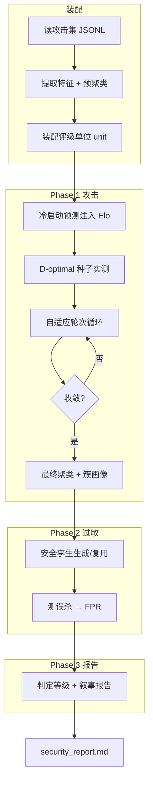

# LLM API 安全性评估系统


> [English](docs/README.en.md) | 中文

一个黑盒 LLM 安全评估框架：输入一份攻击集，自适应地挑选攻击去测试目标模型，用双边 Elo 评级收敛出模型的安全边界，再检测误杀率，最后产出量化的 Markdown 安全报告。

> 本项目评估的是**安全评估管线本身**（自适应采样、威胁排名、能力预测、误杀检测、聚类分析），攻击集只是输入耗材。
>
> 📐 算法机制的深度讲解见 [docs/架构与算法详解.md](docs/架构与算法详解.md)；本文只讲"是什么、为什么、代码在哪"。

## 它做什么


```mermaid
graph LR
    A[攻击集 JSONL] --> B[Phase 1 自适应攻击]
    B --> C[Elo 驱动逐轮采样]
    C --> D[Phase 2 过敏检测]
    D --> E[Phase 3 综合报告]
    E --> F[security_report.md<br/>+ Web 看板]
```

- **Phase 1 攻击**：把攻击方法和目标模型放进同一个 Elo 评级空间（攻击是进攻方、模型是防守方），每轮由采样器挑"信息量最大"的攻击去测，Judge 打分后更新评级，直到防守方（即安全边界）的置信区间收敛。
- **Phase 2 过敏检测**：用"安全孪生"（语义无害、结构与攻击相似的 prompt）测模型是否误杀正常请求，得出误杀率 FPR——安全不能以拒答为代价。
- **Phase 3 综合报告**：合并攻击成功率 ASR + FPR + Elo 边界，输出安全画像与 Markdown 叙事报告。

---

## 代码地图

### 三层架构

```
┌──────────────────────────────────────────────────────────┐
│ 控制层 (control/) — 元控制 / 三省 Agent                    │
│ fork 隔离工作区 · 历史对比 · 批量并行编排 · LLM 对话        │
│ 调用方式: subprocess 调 llmsec / llmsec-manage CLI        │
├──────────────────────────────────────────────────────────┤
│ 信息管理 (llmsec/management/) — llmsec-manage CLI         │
│ run 清理 · 缓存清理 · 快照导出 · 显式 merge 进全局 R       │
├──────────────────────────────────────────────────────────┤
│ 工作单元核心 (llmsec/) — 评估管线                          │
│ runner / eval / clustering / experiments / server / tui    │
│ 默认隔离运行（--work-dir），不自动写全局 R                 │
└──────────────────────────────────────────────────────────┘
```

边界规则：控制层对 llmsec 只走 CLI 子进程 + 读公开产物文件，不 import llmsec 业务代码。唯一例外是 `control/core/paths.py` 复用了 `llmsec.core.paths` 的路径安全原语（防目录穿越，两边必须同一套校验口径）。反方向反而更松：`llmsec/server/routers/control.py` 与 MCP 查询工具会进程内直接 import `control` 包。

### llmsec/ 内部分层（按依赖方向，自底向上）

| 层 | 模块 | 职责 | 关键文件 |
|---|---|---|---|
| L0 | `core/` | 基础设施：配置、I/O、路径、日志、种子 | `results.py`（R 矩阵，原始观测存储）、`units.py`（评级单位）、`isolation.py`（work-dir 重绑）、`config.py` |
| L0 | `params.py` | 全部行为参数的统一入口（见[核心抽象](#核心抽象)） | — |
| L1 | `targets/` | 被测模型后端路由：openai / 本地模拟 / PCAP | `__init__.py` 的 `create_target_client` / `call_target` |
| L1 | `clustering/` | 攻击特征提取与聚类（评级单位从这来） | `features.py`、`hdb.py`、`tree.py`、`space.py` |
| L2 | `evaluation/` | 评估数学核心：打分、评级、采样、预测 | 见下"evaluation/ 一图流" |
| L3 | `attacks/` | 攻击集生成器（样例来源，可自带） | `generate.py`、`harmbench.py` |
| L3 | `pipeline/` | 编排：三阶段串联、多目标循环 | `runner.py`（主入口）、`attack_phase.py`、`allergy_phase.py` |
| L3 | `reporting/` | 报告生成 | `final_report.py`、`report.py` |
| L4 | `management/` | 自我维护 CLI（run/缓存/快照/merge） | `runs.py`、`caches.py`、`merge.py`、`snapshot.py` |
| L4 | `experiments/` | HPO 实验框架（trial 经 subprocess 跑 runner） | `study.py`、`executor.py`、`search.py` |
| L4 | `server/` | Web 看板 + 任务系统 + SSE + 本地模拟模型 | `dashboard_api.py`、`routers/`、`task_manager.py`、`launch.py`（评估/HPO 统一启动层） |
| L5 | `tui/` | 终端指挥台（Textual，独立进程直连 task_manager） | `app.py`、`task_store.py`、`render.py`、`panels/` |
| L5 | `mcp/` | MCP 工具库接口（聚合以上所有能力） | `server.py`、`tools/` |

`evaluation/` 是最大的子包，内部再分：

- `evaluator.py` 的 `evaluate_single` —— **单条攻击的评估原子**：调目标 → 算数学分 → Judge 打分 → 合成 eval_score
- `elo.py` 的 `ELOTracker` —— 双边评级与安全边界；`elo_convergence.py` —— 收敛判据
- `judge.py` 的 `Judge` —— LLM-as-Judge；`prescreen_ml.py` —— 便宜的拒绝预筛（省 Judge API 调用）
- `samplers.py` —— 四种采样策略
- `predictors/` —— 冷启动 Elo 预测：`svd_ridge.py`（回归器）、`blend.py`（跨模型混合）、`cold_start.py`（编排）、`fingerprint.py`（防御指纹）
- `safe_twin.py` —— 安全孪生生成与误杀判定
- `elo_access.py` —— R 矩阵的读写网关（publish / 派生缓存）

依赖方向小结：`core ← evaluation ← pipeline ← server/mcp`；`clustering` 只被 evaluation/pipeline/server 引用、不反向依赖；大量函数内 lazy import 用于打破循环依赖（`pyproject.toml` 的 ruff 配置对此有注释说明）。

---

## 端到端流程：一次评估怎么流过代码

以主入口 `llmsec --input attacks/l1.jsonl`（= `python -m llmsec.pipeline.runner`，见 `pipeline/runner.py` 的 `main()`）为例：


```mermaid
flowchart TD
    subgraph 装配
        A[读攻击集 JSONL] --> B[提取特征 + 预聚类]
        B --> C[装配评级单位 unit]
    end
    subgraph Phase 1 攻击
        C --> D[冷启动预测注入 Elo]
        D --> E[D-optimal 种子实测]
        E --> F[自适应轮次循环]
        F --> G{收敛?}
        G -->|否| F
        G -->|是| H[最终聚类 + 簇画像]
    end
    subgraph Phase 2 过敏
        H --> I[安全孪生生成/复用]
        I --> J[测误杀 → FPR]
    end
    subgraph Phase 3 报告
        J --> K[判定等级 + 叙事报告]
    end
    K --> L[security_report.md]
```

**装配**（`runner.py`）——读攻击集（`core/io.py`）；`--work-dir` 时重绑全部输出路径实现隔离（`core/isolation.py` 的 `rebind_to_workdir`）；加载全局 R 的快照（评估期间不读不写活 R）；提取攻击特征（`evaluation/predictors/cold_start.py` 的 `fit_features` → `clustering/features.py`）；快速预聚类并装配评级单位（`pipeline/attack_phase.py` 的 `_quick_precluster` → `clustering/hdb.py` 的 `compute_cluster_labels` → `core/units.py` 的 `assemble_units`）。

**Phase 1 攻击**（`attack_phase.py` 的 `run_attack_phase`）——

1. 冷启动注入：R 里有 ≥2 个模型时用 `predictors/blend.py` 跨模型预测，否则单模型 `predictors/cold_start.py`；预测值写进 tracker 作未测单位的初始 Elo。
2. 种子实测：`select_d_optimal_seeds` 挑信息量最大的单位，逐个走 `evaluation/evaluator.py` 的 `evaluate_single`，`ELOTracker.update_round` 更新评级；per-seed Elo 向量存为该模型的防御指纹（`predictors/fingerprint.py`）。
3. 自适应轮次循环：`_adaptive_batch_size` 按置信度缩放批量 → 采样器 `select` 挑下一批（`evaluation/samplers.py`）→ 线程池并行 `evaluate_single` → `update_round` 同步更新 Elo → 明细先于状态落盘（崩溃不丢数据）→ `elo_convergence.py` 的 `check_convergence` 判定是否停。
4. 收尾：最终聚类（`cold_start.py` 的 `final_fit`）、簇级安全画像（`evaluation/cluster_analysis.py`）、ASR 统计、越狱税汇总（`pipeline/tax.py`）。

**Phase 2 过敏**（`allergy_phase.py` 的 `run_allergy_phase`）——窗口大小按边界置信度自适应（`adaptive_twin_window`）；在 Elo 边界附近挑高威胁攻击，生成或复用安全孪生（`evaluation/safe_twin.py` 的 `generate_safe_twin`，带缓存），发给目标模型，`judge_allergic` 判定是否误杀 → FPR 写入 `allergy.json`。

**Phase 3 报告**（`reporting/final_report.py` 的 `generate_reports`）——判定安全等级（2×2 画像：安全/过敏/易攻/破防）→ `runner_report.json` → 五维树形画像（`reporting/report.py` 的 `build_tree`）→ LLM 叙事（失败自动回退规则版）→ `security_report.md`。

**写 R**——默认**不**写全局 R（单元化原则）：work-dir 模式写隔离 R；全局模式需显式 `--publish-global`；其余情况用 `llmsec-manage merge` 显式合并。写入走 `evaluation/elo_access.py` 的 `publish_tracker`（文件锁 + 原子写）。

每个目标的产物都在 `output/runs/<时间戳>/<target>/`，明细见[数据与产物](#数据与产物)。

---

## 核心抽象

按"是什么 / 为什么存在 / 在哪"三段式，机制细节一律见 [docs/架构与算法详解.md](docs/架构与算法详解.md)。

### R 矩阵 —— 原始观测

`R[记录id][模型] = MatchResult`，定义在 `core/results.py` 的 `ResultsMatrix`，存于统一库 `output/state/catalog.db` 的 observations 表（`storage/rstore.py` 后端）。R 是**不可重算的原始观测**——Elo、预测器、指纹、孪生集全部可从 R + 攻击特征重算（派生入口：`evaluation/elo.py` 的 `derive_elo`）。并发安全靠 SQLite WAL + 单事务写入（BEGIN IMMEDIATE），备份用 `llmsec-manage storage backup-r`。

### ELOTracker 与安全边界

`evaluation/elo.py`。攻击方法与目标模型在同一 Elo 空间对弈：防守方（模型）的 Elo 就是"安全边界"。三个反直觉的设计——分数幅度进结果项而非 K 因子（连续成绩映射）、防守方 K 随场次衰减（越测越稳）、批内用轮始快照同步更新（顺序无关）。收敛判据在 `elo_convergence.py`：把 Elo 轨迹分解成漂移与噪声，合成"真值 95% CI 半宽"，单一标准判定停机。

### 评级单位（unit）

`core/units.py`。几千条 prompt 逐条评级不稳、按方法名分组太粗，折中是**簇 = 评级单位**：攻击预聚类成簇，簇内共享一个 Elo。unit_id 由成员 md5 生成，跨 run 稳定可续跑；每簇选一条 medoid 代表做实测。聚类的距离度量只用先验特征（不看评估结果），保证发现新弱点不被历史带偏——详见 docs 第 4 节。

### 采样器

`evaluation/samplers.py`，回答"下一批测什么"：`gap`（贴着边界测）、`infogain`（信息增益加权）、`coordinate`（簇坐标下降）、`hybrid`（默认，先覆盖后精搜）。

### 冷启动预测器

`evaluation/predictors/`。评估开始时零观测，用攻击特征回归出未测对象的初始 Elo：底层是 SVD-Ridge 回归器（`svd_ridge.py`），多模型时用 Blend 双层混合（跨模型统一层 + 模型自身层，按样本量收缩权重，`blend.py`），模型间相似度用防御指纹度量（`fingerprint.py`）。细节见 docs 第 3 节。

### Judge

`evaluation/judge.py` 的 `Judge`。LLM-as-Judge 给攻击结果打分：先过便宜的拒绝预筛（`prescreen_ml.py`，关键词 + TF-IDF 分类器，省 API 调用），再判合规等级与有害度，合成统一标度的 eval_score（`evaluation/scoring.py` 的 `compute_eval_score_v2`）。

### 安全孪生与 FPR

`evaluation/safe_twin.py`。把攻击 prompt 用 LLM 改写成语义无害、结构相似的"孪生"，测目标模型是否误杀。ASR（防得严不严）与 FPR（误伤多不多）合起来才是完整画像。

### 越狱税

攻击 prompt 里嵌数学题：越狱成功后数学推理退化多少（`accuracy_drop = 裸基线 − 攻击下`），衡量模型"配合攻击"付出的能力代价。基线在 `evaluation/scoring.py` 的 `measure_math_baseline`，聚合在 `pipeline/tax.py`。

### params.py —— 统一调参入口

`llmsec/params.py` 集中全部行为参数（批量/轮次/Elo/收敛/采样器/Judge/聚类/报告阈值），每个带注释；import 时自动读 `LLMSEC_PARAM_<NAME>` 环境变量覆盖——这也是 HPO trial 的参数注入点。连接配置（API key 等）不在这，在 `.env`（`core/config.py` 读）。

---

## 控制层与三省 Agent

`control/` 是独立于 `llmsec` 的元控制层，把 llmsec 当黑盒工作单元编排：fork 隔离工作区（`core/workspace.py`，基于 `llmsec-manage snapshot export`）、run 历史对比（`core/compare.py`）、批量并行（`core/orchestrator.py`）。对 llmsec 的所有调用集中在 `core/invoker.py`（subprocess）。

三省 Agent（`control/agent/`）是跑在 Web 面板里的 LLM 编排系统，借鉴唐代三省制：

- **中书省**（`zhongshu/`）：对话主入口，`dialogue.py` 的 `handle_message` 判意图——简单查询自己答，复杂指令转尚书省拟案后润色呈给用户。
- **尚书省**（`shangshu/`）：`planner.py` 把指令拆成结构化 Plan（步骤 + 依赖），用户准奏后 `executor.py` 按拓扑分层并行执行。可调度的原子能力共 17 项（`capabilities.py`：run_evaluation / fork_workspace / merge_results / env 快照 CRUD 等），每项自带风险等级。
- **门下省**（`menxia/`）：消息总线（`bus.py`）订阅者，对危险步骤（跑评估 / merge 全局 / 删 R 列）封驳要求确认，任务完成后自动审查产出并呈递简报。

三省的真实入口是 Web 面板的 `POST /api/control/chat`（`llmsec/server/routers/control.py` 进程内直连）；`python -m control chat` 只是**无 LLM 时的规则版兜底 REPL**。Plan 与三省共享记忆持久化在统一库的 ctl_* 表（文牍事件流/Plan/封驳令）。交互时序见 [docs/核心业务时序图.md](docs/核心业务时序图.md)。

---

## 快速开始

### Docker（一行启动，零安装、零配置文件）

```bash
# 完整版（含聚类特征提取 + 预缓存 embedding 模型，~3GB）
docker run -p 8080:8080 -v llmsec-data:/app/output jinxiahz/llmsec

# 精简版（不含聚类/torch，仅攻击评估，~500MB）
docker run -p 8080:8080 -v llmsec-data:/app/output jinxiahz/llmsec:slim
```

容器启动后浏览器打开 `http://localhost:8080`，在「运行控制」页面配置即可——无需手动编辑 `.env`（entrypoint 自动从模板创建，配置经 UI 写入并持久化到 output 卷，`docker restart` 不丢）。

### pip 安装

```bash
pip install -e .              # 核心（不含聚类，无需下载 torch）
pip install -e ".[cluster]"   # 完整（含聚类特征提取 + embedding 模型）
pip install -e ".[dev]"       # 开发（含测试 + lint）
pip install -e ".[tui]"       # 终端界面 llmsec-tui（textual）
pip install -e ".[mcp]"       # MCP server（fastmcp）
```

Python 3.11。`hdbscan`、`sentence-transformers`、`tiktoken` 为聚类模块的可选依赖（安装 `.[cluster]` 时拉入，会附带 `torch` ~2GB；只做攻击评估不需要）；`textual`（TUI）与 `fastmcp`（MCP）同为可选 extra。

### 配置环境

**Docker 用户**：跳过本步，直接在浏览器「运行控制 → 环境参数配置」中填写 API Key / URL / 模型，保存即生效。

**pip 安装用户**：复制 `.env.example` 为 `.env`，填入目标模型与生成模型配置（变量表见[配置](#配置)）。

### 三步跑通

```bash
# 步骤 1：生成攻击集（从 llmsec/攻击分析.md 提取 L1 方法，仅是样例来源）
python -m llmsec.attacks.generate --output attacks/l1.jsonl

# 步骤 2：自适应攻击 + 过敏检测 + 综合报告（主入口）
python -m llmsec.pipeline.runner --input attacks/l1.jsonl --max-rounds 10 --batch-size 10

# 步骤 3：查看报告
cat output/runs/<时间戳>/security_report.md
```

**无真实 LLM 离线测试**：

```bash
# 终端 1：启动本地模拟模型（OpenAI 兼容）
python -m llmsec.server.local_model_server --port 8000

# 终端 2：用 local_sim 模式跑 runner
TARGET_TYPE=local_sim TARGET_BASE_URL=http://127.0.0.1:8000/v1 \
  python -m llmsec.pipeline.runner --input attacks/l1.jsonl --max-rounds 5
```

---

## 使用入口

四个入口共用同一套能力：**Web 面板**（人用）、**TUI 终端**（人用，免开服务）、**CLI**（脚本用）、**MCP 工具库**（外部 agent 用）。

### Web 面板

```bash
# Docker 用户：容器已自带，直接打开 localhost:8080
# pip 用户：
python -m uvicorn llmsec.server.dashboard_api:app --host 127.0.0.1 --port 8080
```

侧边栏板块：**总览**（指标卡/雷达图/趋势）、**威胁看板**（Top 威胁/收敛曲线/盲区）、**报告**（分端渲染 security_report.md）、**聚类分析**（特征空间投影/树切割/簇卡片）、**预测模型**（SVD-Ridge 诊断 + Blend 状态）、**运行控制**（一键启动评估 / HPO 配置台 / 目标与 env 管理 / 任务日志 SSE 直播）、**宣政殿**（三省 Agent 对话面板）。

### TUI 终端指挥台

```bash
pip install -e ".[tui]"     # textual 是可选依赖（extra），核心安装不含
llmsec-tui                  # 或 python -m llmsec.tui
```

Textual 终端界面，**独立进程直连 task_manager 与 MCP 工具层，不需要启动 Web 看板**也能发起评估、看实时进度、翻历史 run。四个面板（数字键 `1-4` 切换，`?` 键位速查）：

- **任务中心**：任务表 + 选中任务的终端进度窗（盲文进度条、OLS 平滑）；`n` 发起评估（目标多选/env 快照隔离/参数覆写全能力面）、`c` 取消（本机 + 跨进程 PID 强杀）、`l` 看完整日志
- **HPO 直播**：trial 进度 + 目标值 sparkline + trial 流水；`s` 选 yaml 启动 study
- **Runs 浏览**：`enter` 读报告、`m`+`v` 标记对比、`e` Elo 榜、`b` 安全边界、`p` 意外发现、`n` 下一批测试建议
- **宣政殿**：中书省规则版对话，自然语言/JSON 指令直接操作控制层（LLM 版在看板，需开服务）

外部任务（看板/MCP 启动的）经落盘 meta 感知真实状态——持有进程崩溃也会判成「已结束」，进度照常增量回放。面板/键位/架构边界详见 [docs/tui.md](docs/tui.md)。

### CLI 命令参考

```bash
# 自适应评估（主入口；llmsec 命令等价）
python -m llmsec.pipeline.runner [--phase {all,1,2}] [--input FILE] [--batch-size N]
                                 [--max-rounds N] [--sampler {gap,infogain,coordinate,hybrid}]
                                 [--target NAME] [--concurrency N]
                                 [--work-dir DIR] [--publish-global]

# 信息管理（写操作默认 dry-run，--yes 执行；删除走软删除可恢复）
llmsec-manage runs list|delete ...      # run 历史与清理
llmsec-manage cache list|clean ...      # 派生缓存占用与清理
llmsec-manage snapshot export ...       # R 快照导出（控制层 fork 的握手点）
llmsec-manage merge --sources ... --target global   # 显式合并进全局 R
llmsec-manage thresholds                # 审查阈值导出（审查方与被审查方同源）

# 控制层
python -m control workspace fork|list|delete|gc ...  # 隔离工作区
python -m control compare <run...>                   # 历史对比（支持 ws: 前缀）
python -m control orchestrate <specs.json>           # 批量并行 fork + run
python -m control chat                               # 规则版兜底 REPL（三省入口在 Web 面板）
python -m control tool <name> [args.json]            # 直接调一个 tool

# HPO 实验框架
python -m llmsec.experiments run|report|trials <study.yaml|name>
```

常用旗标：`--work-dir DIR` 实验隔离模式（所有产物写该目录，全局 `output/` 零写入，fork 分支 / HPO trial 用）；`--publish-global` 全局模式下把观测 publish 进全局 R（默认关，单元化原则）；`--concurrency N` 批内并行度（不传=全并发，0=串行）；`--target` 单目标（不传扫描 `.env` 里声明的全部目标）。

### MCP 工具库

llmsec 可作为 MCP server 暴露给外部 agent（ZCode / Cursor / Claude Desktop），共 **54 个工具**按风险分层（`llmsec/mcp/tools/`）：

| 层 | 模块 | 数量 | 说明 |
|---|---|---|---|
| Tier 1 纯函数 | `compute.py` | 7 | 打分/特征提取等零副作用计算 |
| Tier 2 只读查询 | `query.py` | 23 | run 历史 / Elo 画像 / 工作区 / Plan 文牍 |
| Tier 3 写操作 | `actions.py` | 17 | 危险操作（删 run / 清缓存 / merge）走 preview→confirm 两步 token，低风险直接执行 |
| Tier 4 长任务 | `tasks.py` | 7 | run_evaluation 等异步提交 + 轮询，不阻塞 |

```bash
pip install -e ".[mcp]"        # 安装 fastmcp 依赖
llmsec-mcp                     # stdio 传输（默认，适配 IDE 集成）
llmsec-mcp --transport http --port 8765
```

ZCode / Cursor 配置（stdio 模式）：

```json
{
  "mcpServers": {
    "llmsec": {
      "command": "llmsec-mcp",
      "cwd": "<项目根目录>"
    }
  }
}
```

外部 agent 无需手动编辑 `.env`——用 env_snapshot 工具动态创建隔离配置（`create_env_snapshot` → `edit_env_snapshot` 逐条写入 → `run_evaluation(env_snapshot=...)`），快照只注入 runner 子进程，不碰全局 `.env`。

---

## 数据与产物

```
output/
├── state/
│   └── catalog.db          # 统一库（唯一数据库文件）：R 观测（observations 等
│                           #   表）+ runs/trials/tasks 登记 + control 层表
│                           #   （文牍/Plan/封驳/队列/workspace 索引）+ elo 缓存表
├── cluster/                # 聚类/特征产物（feature/embedding/cluster 缓存）
├── runs/<时间戳>/<target>/ # runner 单次运行产物（报告/明细/树，文件即真相）
├── workspaces/<name>/      # fork 工作区（catalog.db 卫星库 + run 产物）
├── env_snapshots/<name>/   # .env 快照（隔离的连接配置）
├── experiments/<name>/     # HPO study（trial 记录在统一库）
├── tasks/                  # 后台任务（log/progress 流式产物；状态在统一库）
└── .trash/                 # 软删除回收站（可恢复）
```

**存储层（2026-08 深度整合重构）**：`llmsec/storage/` 是唯一数据访问层
（DAO 收口，SQLModel + SQLite WAL，AST 守卫禁止包外 SQL/ORM；control 经
`control.core.storage` 薄契约消费）。**一个库、一个事务域**——R 观测、登记、
control 状态同库，跨域操作可原子。文件只存"产物"（报告/攻击明细/日志流）。
维护命令：`llmsec-manage storage reindex|verify|gc-tasks|trials|migrate-layouts|
migrate-control|backup-r`；缓存 LRU 用 `cache prune --max N`。

**单元化原则**：runner 默认不把观测写进全局 R（`--work-dir` 写隔离 R；全局模式需显式 `--publish-global`）。这避免了"越后面精度越高、分支互相打架"——要把某个工作区/历史 run 的观测合并进全局 R，用显式动作 `llmsec-manage merge`。

---

## 配置

连接配置走 `.env`（`core/config.py` 读取；Docker 用户经 Web UI 写入）：

| 变量 | 说明 | 默认 |
|---|---|---|
| `TARGET_TYPE` | 目标后端：`openai` / `local_sim` / `pcap_judge` | `openai` |
| `TARGET_API_KEY` / `TARGET_BASE_URL` / `TARGET_MODEL` | 目标模型三件套 | deepseek |
| `TARGETS` | 多目标扫描：逗号分隔名称，配合 `TARGET_<N>_*` 四件套 | - |
| `GENERATOR_*` | 攻击生成 / 安全孪生 / 报告叙事模型 | deepseek |
| `JUDGE_MODEL` | Judge 模型（缺省回退 GENERATOR） | 同 GENERATOR |

完整模板见 `.env.example`。行为参数不在此——改 `llmsec/params.py` 或用 `LLMSEC_PARAM_<NAME>` 环境变量覆盖。embedding 降级链：API → 本地缓存 → HF 镜像 → TF-IDF，模型缓存于 `llmsec/.models/` 后完全离线可用。

## 攻击集

**攻击集只是输入耗材**。`llmsec/attacks/` 下的生成器仅是样例来源，自带攻击集只需满足标准 JSONL 格式（每行一条）：

```json
{"id": "唯一标识", "method": "方法名", "category": "类别", "harm_type": "危害类型", "prompt": "攻击文本", "expected_answer": 0, "source": "自定义来源", "functional_category": "standard"}
```

放入 `attacks/` 目录即可运行（也可经 Web 面板拖拽上传）。`expected_answer: 0` 表示该条不参与越狱税统计。📚 HarmBench 引用与许可见 [data/Explication.md](data/Explication.md)。

---

## 开发指南

### 测试

```bash
pip install -e ".[dev]"
pytest tests/               # 全量（默认全离线 mock，秒级）
pytest tests/test_elo.py    # 单文件
pytest -n auto              # 并行（CI 默认）
```

约 1050 个测试（71 个文件；用例数清单由脚本生成于 [tests/INVENTORY.md](tests/INVENTORY.md)，CI 强制校验一致）按子系统组织（test_elo / test_predictors / test_samplers / test_clustering / test_management / test_mcp / test_dashboard / test_experiments / test_tui_* 及回归套件）；`real_api` / `e2e` marker 默认排除，需真实模型时手动触发。完整说明见 [tests/README.md](tests/README.md)。

### 推荐读码路径

1. `llmsec/core/results.py` —— R 矩阵，全系统的数据底座
2. `llmsec/evaluation/evaluator.py` 的 `evaluate_single` —— 一条攻击怎么被打分
3. `llmsec/evaluation/elo.py` 的 `ELOTracker.update_round` + `elo_convergence.py` —— 评级与收敛
4. `llmsec/pipeline/runner.py` 的 `main()` —— 编排全貌
5. `llmsec/pipeline/attack_phase.py` —— Phase 1 主体（种子 → 自适应循环）
6. 之后按兴趣：`samplers.py` / `predictors/` / `clustering/` / `control/agent/`

### 文档索引

| 文档 | 内容 |
|---|---|
| [docs/架构与算法详解.md](docs/架构与算法详解.md) | Elo 动力学 / 收敛判据 / 预测器 / 聚类的机制细节 |
| [docs/API_REFERENCE.md](docs/API_REFERENCE.md) | MCP 54 工具 / HTTP 端点 / CLI 接口参考 |
| [docs/核心业务时序图.md](docs/核心业务时序图.md) | 评估任务与三省 Plan 执行的时序图 |
| [docs/tui.md](docs/tui.md) | TUI 终端指挥台：面板、键位与架构边界 |
| [docs/weekend_hpo_runbook.md](docs/weekend_hpo_runbook.md) | 周末 HPO 挂机跑法：smoke → 三阶段 study 编排（配置见 `experiments/`） |
| [docs/流程追踪报告.md](docs/流程追踪报告.md) | 一次 runner 从启动到退出的逐阶段追踪 |
| [docs/实验框架说明.md](docs/实验框架说明.md) | HPO 实验框架 |
| [docs/攻击特征与聚类深度研究报告.md](docs/攻击特征与聚类深度研究报告.md) | 特征体系与聚类管线调研 |
| [docs/数据结构.md](docs/数据结构.md) | 数据结构权威参考（统一库 15 表 + 文件产物） |

---

## 许可

GPL v3
