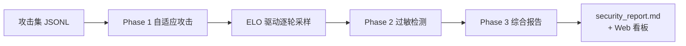

# LLM API 安全性评估系统


> [English](docs/README.en.md) | 中文

一个系统化的黑盒 LLM 安全评估框架：自适应攻击测试 → ELO 威胁排名 → SVD-Ridge / Blend 批量预测 → 过敏检测 → 聚类分析 → 生成可读的 Markdown 安全报告。

> 本项目评估的是**安全评估管线本身**（自适应采样、威胁排名、能力预测、过敏检测、聚类分析），攻击集只是输入耗材。

项目按**三层架构**组织（单元化设计——每个评测是隔离的工作单元，互不污染）：

```
┌──────────────────────────────────────────────────────────┐
│ 控制层 (control/) — 元控制 / agent 中间者                  │
│ fork 新测试环境 · 历史对比 · 批量并行编排 · LLM 对话        │
│ 调用方式: subprocess 调 llmsec CLI；绝不 import llmsec 内部 │
├──────────────────────────────────────────────────────────┤
│ 代码功能 (llmsec/management/) — 信息管理 / 自我维护        │
│ 过滤/清理历史垃圾 · 一键清缓存 · 快照导出 · 显式 merge     │
│ 暴露: llmsec-manage CLI                                   │
├──────────────────────────────────────────────────────────┤
│ 工作单元核心 (llmsec/) — 评估管线（现有代码）              │
│ runner / evaluation / clustering / experiments / server   │
│ 默认隔离运行（--work-dir），不自动写全局 R                 │
└──────────────────────────────────────────────────────────┘
```

---

## 它做什么


```mermaid
graph LR
    A[攻击集 JSONL] --> B[Phase 1 自适应攻击]
    B --> C[ELO 驱动逐轮采样]
    C --> D[Phase 2 过敏检测]
    D --> E[Phase 3 综合报告]
    E --> F[security_report.md<br/>+ Web 看板]
```

- **Phase 1 攻击**：用反向 ELO 驱动逐轮挑选攻击方法，Judge 打分实时更新 ELO，直到防御方真值 Elo 的 95% 置信区间收敛。
- **Phase 2 过敏检测**：在 ELO 边界附近用"安全孪生"（语义安全、结构相似的 prompt）测试模型是否误杀正常请求（FPR）。
- **Phase 3 综合报告**：合并 ASR（攻击成功率）+ FPR（误杀率）+ ELO 边界，输出量化安全画像。

---

## 快速开始

### Docker（一行启动，零安装、零配置文件）

```bash
# 完整版（含聚类特征提取 + 预缓存 embedding 模型，~3GB）
docker run -p 8080:8080 -v llmsec-data:/app/output jinxiahz/llmsec

# 精简版（不含聚类/torch，仅攻击评估，~500MB）
docker run -p 8080:8080 -v llmsec-data:/app/output jinxiahz/llmsec:slim
```

容器启动后浏览器打开 `http://localhost:8080`，在「运行控制」页面配置即可——无需手动编辑 `.env`（entrypoint 自动从模板创建，配置经 UI 写入并持久化到 output 卷，`docker restart` 不丢）。

### pip 安装

```bash
pip install -e .              # 核心（不含聚类，无需下载 torch）
pip install -e ".[cluster]"   # 完整（含聚类特征提取 + embedding 模型）
pip install -e ".[dev]"       # 开发（含测试 + lint）
```

Python 3.11。`hdbscan`、`sentence-transformers`、`tiktoken` 为聚类模块的可选依赖（安装 `.[cluster]` 时拉入，会附带 `torch` ~2GB；只做攻击评估不需要）。

### 配置环境

**Docker 用户**：跳过本步，直接在浏览器「运行控制 → 环境参数配置」中填写 API Key / URL / 模型，保存即生效。

**pip 安装用户**：复制 `.env.example` 为 `.env`，填入目标模型与生成模型配置。

### 三步跑通

```bash
# 步骤 1：生成攻击集（从 llmsec/攻击分析.md 提取 L1 方法）
python -m llmsec.attacks.generate --output attacks/l1.jsonl

# 步骤 2：自适应攻击 + 过敏检测 + 综合报告（主入口）
python -m llmsec.pipeline.runner --input attacks/l1.jsonl --max-rounds 10 --batch-size 10

# 步骤 3：查看报告
cat output/runs/<时间戳>/security_report.md
```

**无真实 LLM 离线测试**：

```bash
# 终端 1：启动本地模拟模型
python -m llmsec.server.local_model_server --port 8000

# 终端 2：用 local_sim 模式跑 runner
TARGET_TYPE=local_sim TARGET_BASE_URL=http://127.0.0.1:8000/v1 \
  python -m llmsec.pipeline.runner --input attacks/l1.jsonl --max-rounds 5
```

---

## Web 面板（图形化工作台）

```bash
# Docker 用户：容器已自带，直接打开 localhost:8080
# pip 用户：
python -m uvicorn llmsec.server.dashboard_api:app --host 127.0.0.1 --port 8080
```

侧边栏版块：

- **总览**：安全等级横幅、ASR/FPR/边界 ELO/置信度指标卡、越狱税均值卡、五维安全画像雷达图、按有害类别 ASR、多批次趋势对比
- **威胁看板**：Top 10 威胁、高威胁方法表（实测/预测徽标 + 95% CI + 越狱税列）、防御方 ELO 收敛曲线、意外盲区
- **报告**：`security_report.md` 分段渲染，带段内导航
- **聚类分析**：验证指标、PCA/t-SNE 特征空间分布图（可切换）、层次聚类树图（缩放查看任意层切割，top-3 k 预设停点）、高风险/盲区/稳定簇卡片
- **预测模型**：单模型层 SVD-Ridge 诊断（正则化路径、主成分解释方差、特征重要性、预测 Elo 置信区间）+ 多模型层 BlendPredictor（发现层 sim-加权状态、donor 相似度、per-target λ）
- **运行控制**：
  - **自适应评估**：选目标模型 / 攻击集 / 阶段 / 批大小 / 轮次 / 采样器，一键启动（批内并行求值）
  - **HPO 配置台**：从 key params 选因子、设范围、选策略（grid/random/bayesian）、预览搜索空间、一键启动 study（作为任务运行）
  - **目标模型管理**：「+」添加目标（写入 .env）、探活检测
  - **环境参数配置**：默认目标 / 生成模型 / Judge 的 base_url + model + api_key（写入 .env，掩码显示）
  - 任务状态与日志实时轮询 + SSE 直播
- **控制台**（控制层）：LLM 驱动的对话中间者（自然语言 → 自动调 fork/compare/merge 等工具）、Fork 工作区管理（创建/列出/删除，显示合并状态）。底层经 `.env` 的 `GENERATOR_*` 模型（复用项目既定约定）

---

## 攻击集

**攻击集只是输入耗材**。`llmsec/attacks/` 下的生成器（`攻击分析.md` 解析、内置 HarmBench 数据包装）仅是测试与示范用的样例来源——你完全可以从任何渠道自带攻击集。

> 📚 HarmBench 引用与许可见 [data/Explication.md](data/Explication.md)。

自带攻击集只需满足标准 JSONL 格式（每行一条）：

```json
{"id": "唯一标识", "method": "方法名", "category": "类别", "harm_type": "危害类型", "prompt": "攻击文本", "expected_answer": 0, "source": "自定义来源", "functional_category": "standard"}
```

放入 `attacks/` 目录后直接运行（也可通过 Web 面板拖拽上传）。

---

## 命令参考

### 自适应评估（主入口）

```bash
python -m llmsec.pipeline.runner [--phase {all,1,2}] [--input FILE] [--batch-size N]
                                 [--max-rounds N] [--twin-window N]
                                 [--sampler {gap,infogain,coordinate,hybrid}]
                                 [--sampler-alpha A] [--sampler-beta B] [--sampler-gamma G]
                                 [--coordinate-rounds R] [--target NAME]
                                 [--concurrency N] [--no-parallel]
                                 [--work-dir DIR] [--publish-global]
```

- `--phase`：`all`（攻击+过敏）、`1`（仅攻击）、`2`（仅过敏）
- `--input`：攻击集路径，相对仓库根目录（如 `attacks/l1.jsonl`）
- `--target`：指定单个目标模型（不传则扫描全部声明目标）
- `--concurrency`：批内并行求值并发度（不传=全并发；0=串行）
- `--work-dir DIR`：**实验隔离模式**——所有产物（R/elo_cache/probes/prescreen/blend/cluster_report/safe_twins 等 9 类）写入该目录，全局 `output/` 零写入。fork 分支 / HPO trial 用
- `--publish-global`：全局模式（无 `--work-dir`）下结束时把观测 publish 进全局 R 矩阵。**默认关**（单元化原则）：评估产物只在 run 目录，更新全局 R 用 `llmsec-manage merge`。看板触发的评估自动带此开关

### 信息管理（自我维护）

```bash
llmsec-manage runs list [--json] [--target NAME] [--since DATE] [--junk-only]  # 列出/过滤 run（含 size）
llmsec-manage runs delete <run...> [--delete-r] [--yes]                        # 删 run（软删除到 .trash/，可恢复）
llmsec-manage cache list [--json]                                             # 各类缓存占用
llmsec-manage cache clean <elo_cache|predictors|feature_cluster|task_logs> [--yes]
llmsec-manage snapshot export [--source global|run:<name>] [--out FILE]        # 导出快照（控制层 fork 用）
llmsec-manage merge --sources <src...> --target <global|ws:name> [--models ...] [--yes]  # 显式合并 R
```

机器友好契约：所有命令支持 `--json` 结构化输出；写操作默认 dry-run 预览，`--yes` 执行；删除走软删除（`output/.trash/`）可恢复。

### 控制层（元控制 / agent）

```bash
python -m control workspace fork <name> [--source global|run:<run>]            # fork 隔离工作区
python -m control workspace list                                               # 列出工作区
python -m control compare <run...> [--json]                                    # 历史对比（支持 ws: 前缀）
python -m control orchestrate <specs.json> [--workers N]                       # 批量并行 fork + run
python -m control chat                                                         # 交互式 LLM 对话中间者
python -m control tool <name> [args.json]                                      # 直接调一个 tool（供脚本/agent）
```

控制层把 llmsec 当独立工作单元经 subprocess 调用，**绝不 import llmsec 内部**。对话中间者用 `.env` 的 `GENERATOR_*` 模型做 LLM tool-calling（7 个工具：list_runs / compare_runs / fork_workspace / list_workspaces / delete_workspace / orchestrate / merge），未配置 LLM 时自动回退规则版。

### 实验框架

```bash
python -m llmsec.experiments run <study.yaml>      # 运行/续跑 study
python -m llmsec.experiments report <name>         # 最佳 config + 对比表
python -m llmsec.experiments trials <name>         # 列出全部 trial
```

### 测试

```bash
pytest tests/                    # 全量
pytest tests/test_elo.py         # 示例：单文件
pytest -n auto                   # 并行（CI 默认）
```

> 📚 完整测试矩阵见 [tests/README.md](tests/README.md)。

---

## 核心概念

### 反向 ELO + K 动力学

攻击方法是进攻方，目标模型是防守方。攻击成功 → 攻击方法 ELO 上升；被防住 → 下降。防守方 ELO 就是"安全边界"，ELO 越高的攻击方法威胁越大。

- **连续成绩映射**：`perf = score/(score+τ)`（饱和），把分数幅度放进结果项而非 K 因子，根治早期 ELO 来回跳。
- **K 衰减**：攻击方用全 K（每法通常只测 1~2 次）；防御方每场必上，`K_def = K / sqrt(max(1, n/N0))`，场次越多评级越稳。
- **同步轮次更新（Model B）**：一个 round 的全部攻击用轮始快照算 delta（防御方是固定模型，批内攻击是对同一状态的同时独立观测），攻击方各自更新、防御方一次性加总。批内顺序无关、消除 batch↔K 耦合。防御方聚合步长除以 √N（有效独立数），避免 N×全 K 求和过冲。

### 单一 CI 收敛判据

把防御方 Elo 轨迹做 OLS，分离**漂移**（朝真值移动）与**噪声**（随机抖动），合成"真值 Elo 的 95%CI 半宽"。收敛当且仅当 CI 半宽 + 漂移 + 覆盖率均达标。CI 极紧时自动放宽 drift 门槛（漂移比测量精度小时无实质影响）。

### Blend 双层预测（冷启动）

未测方法的初始 Elo 由预测器给出，自适应混合两层：
- **统一预测 P_u**：跨所有模型池化训练，捕获"方法内在威胁"（强越狱对多数模型都强）。
- **模型预测 P_m**：仅用该模型列训练，捕获模型特异性弱点。
- **混合** `pred = w_u·P_u + w_m·P_m`，其中 `w_m = n_model/(n_model + K)`：样本少 → 全靠统一；样本多 → 信任自身。

底层是 **SVD-Ridge**：用已测方法的特征矩阵 X 和派生 Elo y 训练 Ridge，对 X 做 SVD 分解一次前向传播得到全部未测方法预测；K-Fold 在正则化路径 λ 上选最优；每个预测附带 MAP 不确定性。

### 发现层：探针指纹 + 相似度迁移

冷启动时跑 D-optimal 哨兵种子（特征驱动、矩阵独立），per-seed Elo 向量即该模型的"防御指纹"。两模型指纹的相关系数量化行为相似度，BlendPredictor 据此做**相似度加权池化**（从相似 donor 借先验，取代弱 universal 均匀平均）。指纹独立于累积 R，符合"发现测试不依赖过去的矩阵"。

### 统一先验度量空间 + 聚类（post-test）

聚类与预测的距离度量**只使用先验特征**。先 z-score 标准化，再 SVD 降维 + 谱拐点截断噪声尾。测试结束后用真实机器反应做弱监督特征加权。HDBSCAN（EOM）密度聚类，从同一棵可缩放树切出候选 k，轮廓系数/CH/DB 合成取全局 argmax。

### 采样器

- `gap`：按 |攻击ELO − 防御ELO| 最小选择
- `infogain`：全局信息增益（分差 + 不确定性 + 簇覆盖 + 成功潜力），gap 归一化到 [0,1) 与其它项等量级平权
- `coordinate`：簇坐标下降（外层轮询簇，内层选边界附近方法）
- `hybrid`（默认）：前若干轮 InfoGain 快速覆盖，之后切 Coordinate 精细搜索

### ASR + FPR 二维画像

- **ASR**（攻击成功率）：衡量防线强度
- **FPR**（误杀率）：用"安全孪生"测试模型是否误伤正常请求

### 越狱税（Jailbreak Tax）

攻击 prompt 中嵌入数学题。越狱成功后若数学推理退化，说明模型为"配合"付出了能力代价。`accuracy_drop = 基线 − 攻击下` 才是真实的越狱退化。`expected_answer: 0` 表示该条不测越狱税。

### 数据存储与可重建性

整个评估体系的原始观测是**结果矩阵 R**（`core/results.py`）：`R[method][model] = MatchResult`。R 是唯一不可重算的存储，其余（Elo、预测器、收敛判定）都是从 R + 方法特征 X **派生**的缓存，可随时全量重算。

存储布局（`output/state/`）：`results.json`（R 主存储，权威）+ `elo_cache.json`（派生缓存，可删可重建）。收敛轨迹自轮次编号（`round`）随观测记入 R 的 `extra` 后，`derive_elo` 在 round 单调时按轮回放重建；累积/混杂 R 回退逐场回放。

**单元化原则**：runner 默认不自动把观测 publish 进全局 R（`--work-dir` 模式写隔离 R；全局模式需显式 `--publish-global`）。这避免了「越后面精度越高、分支互相打架」——全局 R 不再被每次 run 累加污染。要把某个工作区/历史 run 的观测合并进全局 R，用显式动作 `llmsec-manage merge`。

---

## 配置

### 行为参数

> 🎛️ **调行为参数改 `llmsec/params.py`**——全项目统一调参入口，按模块分组，每个参数带作用解释与审查意见。
>
> 也可经环境变量覆盖：`LLMSEC_PARAM_<NAME>=value`（HPO 框架的参数注入点）。

### 连接配置（环境变量）

| 变量 | 说明 | 默认 |
|---|---|---|
| `TARGET_TYPE` | 目标后端：`openai` / `local_sim` / `pcap_judge` | `openai` |
| `TARGET_API_KEY` | 目标模型 API Key | - |
| `TARGET_BASE_URL` | 目标模型地址 | `https://api.deepseek.com/v1` |
| `TARGET_MODEL` | 目标模型名 | `deepseek-v4-flash` |
| `TARGETS` | **多目标扫描**：逗号分隔名称，配合 `TARGET_<N>_*` 四件套 | - |
| `GENERATOR_API_KEY` | 攻击生成/安全孪生/报告叙事 API Key | - |
| `GENERATOR_BASE_URL` | 生成模型地址 | `https://api.deepseek.com/v1` |
| `GENERATOR_MODEL` | 生成模型名 | `deepseek-v4-flash` |
| `JUDGE_MODEL` | Judge 模型名（缺省回退 GENERATOR） | `deepseek-v4-flash` |

完整配置模板见 `.env.example`。

embedding 降级链：API embedding → 本地缓存 → HF 镜像 → TF-IDF。模型首次经镜像下载后缓存于 `llmsec/.models/`，之后完全离线可用。

---

## 目录结构

```
llmsec/                   # 纯源码包（工作单元核心 + 代码功能）
├── params.py             # 统一调参入口
├── core/                 # config / results(R 矩阵) / io / llm / isolation / text / logging / seed
├── targets/              # 目标后端路由: openai / local_sim / pcap_judge
├── evaluation/           # elo / judge / evaluator / elo_cluster / blend_predictor
│                         # elo_access / model_fingerprint / samplers / safe_twin
├── attacks/              # 攻击集生成器: generate / harmbench
├── pipeline/             # runner / attack_phase / allergy_phase / multi_target / tax
├── reporting/            # report / final_report
├── clustering/           # space / hdb / tree / features / posterior / pipeline / cli
├── experiments/          # HPO: study / executor / search / metrics / schema
├── management/           # 信息管理: runs / caches / snapshot / merge（llmsec-manage CLI）
└── server/               # dashboard_api / routers / local_model_server / templates / static

control/                  # 控制层（元控制 / agent，独立于 llmsec）
├── config.py             # 定位 llmsec（PYTHON / 仓库根 / output 路径）
├── core/                 # invoker(subprocess) / workspace(fork) / compare / orchestrator
├── agent/                # tools(schema) / loop(规则对话) / chat(LLM对话) / llm(client)
└── cli.py                # python -m control CLI

docker/                   # Docker 配置
├── Dockerfile            # 完整版镜像（含聚类 + torch）
├── Dockerfile.slim       # 精简版镜像（仅攻击评估）
├── docker-compose.yml    # 一键启动
└── docker-entrypoint.sh  # 容器入口（自动创建/恢复 .env）

attacks/                  # 攻击集（用户可见，拖拽上传目标）
data/                     # 静态参考数据（HarmBench + 越狱模板）
output/                   # 所有生成产物
.env                      # 环境配置（API 密钥等）
```

---

## 输出文件布局

```
output/
├── state/                  # 持久化状态（全局）
│   ├── results.json        #   R 矩阵（唯一真相，多模型）
│   ├── elo_cache.json      #   派生 Elo 缓存（可删可重建）
│   ├── probes.json         #   模型防御指纹（发现层）
│   └── safe_twins.jsonl    #   安全孪生集
├── predictors/             # BlendPredictor 派生缓存
├── runs/<时间戳>/          # runner 单次运行产物
│   ├── attack_results.jsonl      # 攻击详情（含响应原文）
│   ├── runner_report.json        # 综合报告
│   ├── allergy.json              # 过敏报告 + 2D 画像
│   ├── cluster_security_analysis.json  # 簇级安全分析 + 模型诊断
│   └── security_report.md        # LLM 叙事报告（最终交付物）
├── workspaces/<name>/      # 控制层 fork 工作区（隔离的工作单元）
│   ├── results.json              #   该分支独立的 R 矩阵（fork 起点快照 + 本次观测）
│   ├── <target>/                 #   runner 产物（runner_report.json 等，同上）
│   └── _index.json               #   工作区索引（来源/合并状态）
├── snapshots/<时间戳>/     # 快照导出（临时，控制层 fork 消费后清理）
├── .trash/<时间戳>/        # 软删除回收站（删 run/清缓存移入，可恢复）
└── experiments/<name>/     # HPO study
```

`--work-dir` 隔离模式下，上述全局产物（results/elo_cache/feature_cache/cluster_result/cluster_report/predictors/probes/prescreen_model/safe_twins/allergy_results 共 9 类）全部重定向到 work-dir，全局 `output/` 零写入。

---

## 许可

GPL v3
