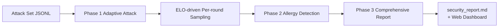

# LLM API Security Assessment System


> [中文](../README.md) | English

A systematic black-box LLM security assessment framework: adaptive attack testing → ELO threat ranking → SVD-Ridge / Blend prediction → allergy detection → cluster analysis → human-readable Markdown security report.

> This project evaluates **the assessment pipeline itself** (adaptive sampling, threat ranking, capability prediction, allergy detection, cluster analysis). Attack sets are consumable inputs.

The project is organized in **three layers** (unitized design — each evaluation is an isolated work unit):

```
┌──────────────────────────────────────────────────────────┐
│ Control Layer (control/) — Meta-control / Agent            │
│ Three-province Agent system · fork test envs · compare ·   │
│ batch orchestration · LLM dialogue                         │
│ Calls llmsec via subprocess; never imports llmsec internals│
├──────────────────────────────────────────────────────────┤
│ Self-Management (llmsec/management/) — Info management     │
│ Filter/clean history · one-click cache clean · snapshots · │
│ explicit merge · Exposed via: llmsec-manage CLI            │
├──────────────────────────────────────────────────────────┤
│ Work Unit Core (llmsec/) — Assessment pipeline              │
│ runner / evaluation / clustering / experiments / server    │
│ Isolated by default (--work-dir); no auto-publish to R     │
└──────────────────────────────────────────────────────────┘
```

---

## What It Does



- **Phase 1 Attack**: Reverse ELO drives per-round attack method selection. Judge scores update ELO in real-time until the defender's true Elo 95% CI converges.
- **Phase 2 Allergy Detection**: Near the ELO boundary, "safe twins" (semantically safe, structurally similar prompts) test whether the model over-blocks legitimate requests (FPR).
- **Phase 3 Report**: Combines ASR (attack success rate) + FPR (false positive rate) + ELO boundary into a quantitative security profile.

---

## Quick Start

### Docker (one-line startup, zero install, zero config)

```bash
# Full version (clustering + pre-cached embedding model, ~3GB)
docker run -p 8080:8080 -v llmsec-data:/app/output jinxiahz/llmsec

# Slim version (no clustering/torch, attack evaluation only, ~500MB)
docker run -p 8080:8080 -v llmsec-data:/app/output jinxiahz/llmsec:slim
```

Open `http://localhost:8080` in your browser and configure via the dashboard — no manual `.env` editing needed (entrypoint auto-creates from template, config persists to output volume).

### pip install

```bash
pip install -e .              # Core (no clustering, no torch)
pip install -e ".[cluster]"   # Full (clustering + embedding model)
pip install -e ".[dev]"       # Development (tests + lint)
pip install -e ".[tui]"       # Terminal UI llmsec-tui (textual)
pip install -e ".[mcp]"       # MCP server (fastmcp)
```

Python 3.11 required. `hdbscan`, `sentence-transformers`, `tiktoken` are optional dependencies for clustering (installing `.[cluster]` pulls in `torch` ~2GB; not needed for attack evaluation only); `textual` (TUI) and `fastmcp` (MCP) are optional extras too.

### Three Steps

```bash
# Step 1: Generate attack set
python -m llmsec.attacks.generate --output attacks/l1.jsonl

# Step 2: Adaptive attack + allergy detection + report (main entry)
python -m llmsec.pipeline.runner --input attacks/l1.jsonl --max-rounds 10 --batch-size 10

# Step 3: View report
cat output/runs/<timestamp>/security_report.md
```

**Offline testing (no real LLM)**:

```bash
# Terminal 1: local simulated model
python -m llmsec.server.local_model_server --port 8000

# Terminal 2: run with local_sim
TARGET_TYPE=local_sim TARGET_BASE_URL=http://127.0.0.1:8000/v1 \
  python -m llmsec.pipeline.runner --input attacks/l1.jsonl --max-rounds 5
```

---

## Web Dashboard

```bash
# Docker: already running at localhost:8080
# pip:
python -m uvicorn llmsec.server.dashboard_api:app --host 127.0.0.1 --port 8080
```

Sidebar sections:

- **Overview**: Security level banner, ASR/FPR/boundary ELO/confidence metric cards, jailbreak tax card, five-dimensional radar, per-category ASR, multi-batch trend
- **Threat Board**: Top 10 threats, high-threat method table (measured/predicted badges + 95% CI + jailbreak tax), defender ELO convergence curve, surprise blind spots
- **Report**: `security_report.md` rendered with section navigation
- **Clustering**: Validation metrics, PCA/t-SNE feature space (switchable), hierarchical cluster tree (zoom to any cut level), high-risk/blind-spot/stable cluster cards
- **Prediction Model**: Single-model SVD-Ridge diagnostics (regularization path, PCA explained variance, feature importance, predicted Elo CI) + multi-model BlendPredictor (discovery layer sim-weighted state, donor similarity, per-target λ)
- **Run Control**: Adaptive evaluation (select target / attack set / phase / batch size / rounds / sampler), HPO config, target model management, environment config, real-time task polling + SSE
- **Grand Secretariat** (Control Layer): Three-province LLM Agent system —
  - **Secretariat** (中书省): Main dialogue entry, understands intent, handles simple queries, delegates complex instructions to the Department of State for planning
  - **Department of State** (尚书省): Full capability manifest (17 capabilities), decomposes complex instructions into structured Plans (steps + dependencies), executes topologically after user approval
  - **Chancellery** (门下省): Bus subscriber, constantly monitors, blocks dangerous steps (run evaluation / merge to global / delete R column) for confirmation, auto-reviews and presents briefings after task completion
  - Three provinces collaborate via an in-process message bus, each with its own frontend panel

## TUI Console

```bash
pip install -e ".[tui]"     # textual is an optional extra
llmsec-tui                  # or: python -m llmsec.tui
```

A Textual terminal UI that talks to the task manager and MCP tool layer **in its own process — no web dashboard needed** to launch evaluations, watch live progress, or browse past runs. Four panels (switch with `1`-`4`, `?` for keymap help):

- **Task Center**: task table + per-task terminal progress window (braille progress bars); `n` launch evaluation (multi-target, env-snapshot isolation, param overrides), `c` cancel (local + cross-process via PID), `l` full log
- **HPO Live**: trial progress + objective sparkline + trial feed; `s` pick a study yaml and start
- **Runs Browser**: `enter` read report, `m`+`v` mark & compare runs, `e` attacker Elo ranking, `b` security boundary, `p` surprises, `n` next-pairing suggestions
- **Grand Secretariat**: rule-based dialogue driving the control layer (the LLM version lives in the web dashboard)

External tasks (started by the dashboard/MCP) are tracked via on-disk meta — even if the holder process crashed, status shows as finished and progress replays incrementally. Details in [tui.md](tui.md) (Chinese).

---

## Attack Sets

**Attack sets are consumable inputs.** The generators under `llmsec/attacks/` are sample sources for testing — you can bring your own from any source.

> 📚 HarmBench citation & license: see [data/Explication.md](../data/Explication.md).

Custom attack sets just need standard JSONL format (one entry per line):

```json
{"id": "unique-id", "method": "method-name", "category": "category", "harm_type": "harm-type", "prompt": "attack-text", "expected_answer": 0, "source": "custom", "functional_category": "standard"}
```

Place in `attacks/` directory and run (or drag-drop via web dashboard).

---

## Command Reference

### Adaptive Evaluation (main entry)

```bash
python -m llmsec.pipeline.runner [--phase {all,1,2}] [--input FILE] [--batch-size N]
                                 [--max-rounds N] [--twin-window N]
                                 [--sampler {gap,infogain,coordinate,hybrid}]
                                 [--sampler-alpha A] [--sampler-beta B] [--sampler-gamma G]
                                 [--coordinate-rounds R] [--target NAME]
                                 [--concurrency N] [--no-parallel]
                                 [--work-dir DIR] [--publish-global]
```

- `--work-dir DIR`: **Isolation mode** — all artifacts (R/elo_cache/probes/prescreen/blend/cluster_report/safe_twins, 9 types) written to this directory, zero writes to global `output/`. For fork branches / HPO trials.
- `--publish-global`: In global mode (no `--work-dir`), publish observations to global R matrix. **Off by default** (unitization principle): artifacts stay in run dir; use `llmsec-manage merge` to update global R.

### Self-Management (llmsec-manage)

```bash
llmsec-manage runs list [--json] [--target NAME] [--since DATE] [--junk-only]  # List/filter runs
llmsec-manage runs delete <run...> [--delete-r] [--yes]                        # Delete runs (soft-delete to .trash/)
llmsec-manage cache list [--json]                                             # Cache usage
llmsec-manage cache clean <predictors|feature_cluster|model_state> [--yes]
llmsec-manage snapshot export [--source global|run:<name>] [--out FILE]        # Export snapshot
llmsec-manage merge --sources <src...> --target <global|ws:name> [--models ...] [--yes]  # Merge R
```

Machine-friendly contracts: all commands support `--json`; writes default to dry-run preview, `--yes` executes; deletions are soft (to `output/.trash/`), recoverable.

### Control Layer (Meta-control / Three-Province Agent)

```bash
python -m control workspace fork <name> [--source global|run:<run>]            # Fork isolated workspace
python -m control workspace list                                               # List workspaces
python -m control compare <run...> [--json]                                    # Compare runs (supports ws: prefix)
python -m control orchestrate <specs.json> [--workers N]                       # Batch parallel fork + run
python -m control chat                                                         # Interactive LLM dialogue (Secretariat)
python -m control tool <name> [args.json]                                      # Direct tool call (for scripts/agents)
```

The control layer treats llmsec as an independent work unit via subprocess, **never imports llmsec internals**. Three-province Agents use `.env`'s `GENERATOR_*` model for LLM tool-calling, auto-falling back to rule-based mode when LLM is unconfigured.

**Three-Province Architecture** (`control/agent/`):
- **Secretariat** (`zhongshu.py`): Dialogue front, understands intent and judges complexity, handles simple queries, delegates complex instructions via `request_shangshu_plan`
- **Department of State** (`shangshu/`): `planner.py` drafts structured Plan → user approves → `executor.py` executes topologically in parallel layers; 16 capabilities (run_evaluation / fork_workspace / create_env_snapshot / merge_results, etc.)
- **Chancellery** (`menxia.py`): Bus subscriber, blocks dangerous steps by risk_level, auto-reviews on plan_done; `.env` snapshots (`env_snapshot.py`) isolate connection config

**.env Snapshots** (`output/env_snapshots/`): Independent resource — create/edit/merge/delete. Run experiments with isolated model lists / judge / params without touching global `.env`.

### Experiment Framework

```bash
python -m llmsec.experiments run <study.yaml>      # Run/resume study
python -m llmsec.experiments report <name>         # Best config + comparison table
python -m llmsec.experiments trials <name>         # List all trials
```

### Testing

```bash
pytest tests/                    # Full suite
pytest -n auto                   # Parallel (CI default)
```

---

## Core Concepts

### Reverse ELO + K Dynamics

Attack methods are the offense; target models are the defense. Successful attacks raise the method's ELO; blocked attacks lower it. The defender ELO is the "security boundary".

- **Continuous score mapping**: `perf = score/(score+τ)` (saturating) — puts score magnitude in the outcome term, not the K factor.
- **K decay**: Attackers use full K (each method typically tested 1-2 times); defenders `K_def = K / sqrt(max(1, n/N0))` — more matches → more stable rating.
- **Synchronous round update (Model B)**: All attacks in a round use the round-start snapshot; defender aggregates with √N scaling, eliminating batch↔K coupling.

### CI-based Convergence

Defender Elo trajectory decomposed into drift (toward true value) and noise (random jitter). Convergence = CI half-width + drift + coverage all within targets. Drift threshold auto-relaxes when CI is very tight.

### Blend Dual-Layer Prediction (Cold Start)

- **Universal predictor P_u**: Pooled across all models, captures "method intrinsic threat"
- **Model predictor P_m**: Per-model column, captures model-specific weaknesses
- **Blend**: `pred = w_u·P_u + w_m·P_m`, where `w_m = n/(n+K)` (Bayesian shrinkage)

Underlying: **SVD-Ridge** — train Ridge on feature matrix X and derived Elo y, SVD decompose X once for all unmeasured predictions; K-Fold selects optimal λ; each prediction has MAP uncertainty.

### Discovery Layer: Probe Fingerprint + Similarity Transfer

Cold-start D-optimal sentinel seeds → per-seed Elo vector = model "defense fingerprint". Cross-model correlation → similarity-weighted pooling (borrow from similar donors). Fingerprints are independent of accumulated R.

### Unified Prior Metric Space + Clustering (post-test)

Distance metric uses only prior features. Z-score normalize → SVD dimensionality reduction + spectral elbow truncation → post-test feature weighting from real machine reactions. HDBSCAN (EOM) density clustering, silhouette/CH/DB composite for optimal k selection.

### Samplers

- `gap`: Select by |attack_ELO − defense_ELO| minimum
- `infogain`: Global information gain (score diff + uncertainty + cluster coverage + success potential)
- `coordinate`: Cluster coordinate descent (outer round-robin clusters, inner boundary selection)
- `hybrid` (default): InfoGain for initial coverage, then Coordinate for fine search

### ASR + FPR Dual Profile

- **ASR** (attack success rate): Measures defense strength
- **FPR** (false positive rate): Tests if model over-blocks legitimate requests via "safe twins"

### Jailbreak Tax

Math problems embedded in attack prompts. If math reasoning degrades after jailbreak, the model paid a capability cost. `accuracy_drop = baseline − under-attack` is the true jailbreak degradation.

### Data Storage & Reproducibility

The result matrix **R** (`core/results.py`): `R[method][model] = MatchResult` is the single non-recomputable source of truth. All derived data (Elo, predictors, convergence) are caches recomputable from R + method features X.

**Unitization principle**: runner does not auto-publish observations to global R by default (`--work-dir` mode writes isolated R; global mode requires explicit `--publish-global`). This avoids "later runs have higher precision, branches fighting each other" — global R is no longer polluted by cumulative runs. To merge observations from a workspace/historical run into global R, use explicit `llmsec-manage merge`.

---

## Configuration

### Behavior Parameters

> 🎛️ **Tune behavior via `llmsec/params.py`** — the unified parameter entry, grouped by module with explanations.
>
> Override via environment: `LLMSEC_PARAM_<NAME>=value` (HPO framework's injection point).

### Connection Config (environment variables)

| Variable | Description | Default |
|---|---|---|
| `TARGET_TYPE` | Target backend: `openai` / `local_sim` / `pcap_judge` | `openai` |
| `TARGET_API_KEY` | Target model API Key | - |
| `TARGET_BASE_URL` | Target model URL | `https://api.deepseek.com/v1` |
| `TARGET_MODEL` | Target model name | `deepseek-v4-flash` |
| `TARGETS` | **Multi-target scan**: comma-separated names + `TARGET_<N>_*` | - |
| `GENERATOR_API_KEY` | Attack gen / safe twin / report API Key | - |
| `GENERATOR_BASE_URL` | Generator model URL | `https://api.deepseek.com/v1` |
| `GENERATOR_MODEL` | Generator model name | `deepseek-v4-flash` |
| `JUDGE_MODEL` | Judge model (falls back to GENERATOR) | `deepseek-v4-flash` |

Full template: `.env.example`.

---

## Directory Structure

```
llmsec/                   # Source package (work unit core + self-management)
├── params.py             # Unified parameter entry
├── core/                 # config / results(R matrix) / io / llm / isolation / text / logging / seed
├── targets/              # Target backends: openai / local_sim / pcap_judge
├── evaluation/           # elo / judge / evaluator / elo_cluster / blend_predictor
│                         # elo_access / model_fingerprint / samplers / safe_twin
├── attacks/              # Attack set generators: generate / harmbench
├── pipeline/             # runner / attack_phase / allergy_phase / multi_target / tax
├── reporting/            # report / final_report
├── clustering/           # space / hdb / tree / features / posterior / pipeline / cli
├── experiments/          # HPO: study / executor / search / metrics / schema
├── management/           # Self-management: runs / caches / snapshot / merge (llmsec-manage CLI)
└── server/               # dashboard_api / routers / local_model_server / templates / static

control/                  # Control layer (Three-Province Agent, independent of llmsec)
├── config.py             # Locate llmsec (PYTHON / repo root / output paths)
├── core/                 # invoker(subprocess) / workspace(fork) / compare / orchestrator
│                         # env_snapshot(.env snapshot isolation)
├── agent/                # Three-Province Agents + message bus
│   ├── prompts.py        #   Three-province system prompts (centralized)
│   ├── bus.py            #   Message bus (publish/subscribe/retain)
│   ├── zhongshu.py       #   Secretariat (intent + delegate + polish)
│   ├── menxia.py         #   Chancellery (bus subscriber + block + auto-review)
│   ├── shangshu/         #   Department of State (plan / capabilities / docs / planner / executor)
│   ├── tools.py          #   Secretariat query tools (6)
│   ├── review.py         #   Review reports (read → rule-based → digest)
│   ├── session.py        #   Dialogue session management
│   ├── loop.py           #   Rule-based dialogue fallback
│   └── llm.py            #   OpenAI client (reads GENERATOR_* env)
└── cli.py                # python -m control CLI

docker/                   # Docker configs
attacks/                  # Attack sets (user-visible, drag-drop target)
data/                     # Static reference data (HarmBench + jailbreak templates)
output/                   # All generated artifacts
.env                      # Environment config (API keys, etc.)
```

---

## Output Layout

```
output/
├── state/                  # Persistent state (global)
│   ├── catalog.db          #   Unified DB: R observations + runs/trials/tasks
│   │                       #   registries + elo_cache/probes derived tables
│   │                       #   + control-layer tables (single DB file)
│   └── safe_twins.jsonl    #   Safe twin set
├── predictors/             # BlendPredictor derived cache
├── runs/<timestamp>/       # Runner single-run artifacts
├── workspaces/<name>/      # Control layer fork workspaces (isolated work units)
├── env_snapshots/<name>/   # .env snapshots (isolated connection config, independent)
├── plans/<id>.json         # Department of State Plan persistence (steps + deps + status)
├── snapshots/<timestamp>/  # Snapshot export (temporary, consumed by fork)
├── .trash/<timestamp>/     # Soft-delete recycle bin (recoverable)
└── experiments/<name>/     # HPO studies
```

With `--work-dir` isolation, all 9 artifact types are redirected to the work-dir; global `output/` has zero writes.

---

## License

GPL v3
