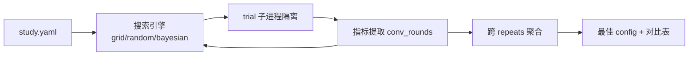

# 实验框架（HPO）

> [English](experiments.en.md) | 中文

`llmsec/experiments/` 是一套超参搜索（HPO）框架，用于系统性寻找最优的评估行为参数与采样策略——目标是**以最少的测试次数（API 调用）收敛到可靠的 Elo 安全边界**。

---

## 1. 为什么需要它

评估管线的质量取决于大量旋钮：Elo 的 K 值与 τ、收敛阈值、采样器权重与策略、batch 大小……这些参数互相耦合，手调既慢又不可复现。实验框架把它们当成可搜索的**因子（factor）**，自动化地：

- 在搜索空间里枚举/采样 config 组合
- 每个 config 用多个随机 seed 重复跑（repeats），抹平随机性
- 提取科学度量，按目标聚合排序，给出"最佳 config"
- 全程可复现、可断点续跑

核心优化目标是 **`conv_rounds`**（首次收敛的轮次，越小越好）——轮次少 = 真实 API 调用少 = 评估更省。

---

## 2. 架构



- **study**：一次实验运行，由一份 `study.yaml` 定义搜索空间、目标与预算。
- **trial**：单个 config × 单个 seed 的一次 runner 运行。每个 trial 在**独立 work-dir** 里以子进程跑 runner，**不碰全局 `state`/`results`**，互不污染。
- **manifest**：每个 trial 落盘 `manifest.json`（git 版本 / params 快照 / argv / 攻击集 sha1 / seed / 库版本 / `.env` 脱敏键），保证"最佳 config"可精确复现。

---

## 3. study.yaml 格式

```yaml
name: sampler-tuning          # study 名称（决定输出目录 output/experiments/<name>/）
description: 调采样器与 Elo K 值
strategy: bayesian            # grid | random | bayesian(optuna TPE)
repeats: 3                    # 每个 config 重复的 seed 数（抹平随机性）
seed_base: 0                  # seed = seed_base + i
budget:
  max_trials: 30              # 总 trial 预算上限

objective:                    # 优化目标
  metric: conv_rounds         # 度量名（见 §5）
  direction: minimize         # minimize | maximize
  aggregate: mean             # 跨 repeats 聚合：mean | mean_plus_std

# 锁定维度：每个 trial 都用这些固定值
fixed:
  input: l1.jsonl             # 攻击集（相对 output/，或带 attacks/ 前缀）
  target: deepseek-v4-flash   # 被测模型
  max_rounds: 12

# 搜索空间：要调的因子
space:
  sampler:                    # categorical 因子
    choices: [hybrid, infogain, coordinate]
  batch_size:                 # int 因子
    type: int
    low: 5
    high: 15
    step: 5
  K_FACTOR:                   # params 因子（注入 LLMSEC_PARAM_K_FACTOR）
    type: int
    low: 16
    high: 48
    step: 8
  SCORE_PERF_TAU:             # float 因子（对数空间采样）
    type: float
    low: 1.0
    high: 4.0
    log: true
```

### 因子分两类（见 `schema.py: resolve_trial`）

| 因子类别 | 例子 | 注入方式 |
|---|---|---|
| **CLI 因子** | `sampler` / `batch_size` / `max_rounds` / `sampler_alpha` / `coordinate_rounds` / `target` / `input` … | 翻译成 runner argv 旗标（`--sampler` 等） |
| **params 因子** | `K_FACTOR` / `SCORE_PERF_TAU` / `CONV_CI_TARGET` … 任意 `params.py` 常量 | 注入环境变量 `LLMSEC_PARAM_<NAME>`，由 `params.py` 在 import 时生效 |

> 也就是说：`params.py` 里的**任意**行为参数都能当因子搜——子进程在 import `llmsec.params` 前设好 `LLMSEC_PARAM_<NAME>=value`，绑定即生效，无需改代码。

因子类型：`int` / `float`（可选 `log: true` 对数采样）/ `categorical`（`choices` 列表）。

---

## 4. 搜索策略

| 策略 | 说明 | 适用 |
|---|---|---|
| `grid` | 笛卡尔积全枚举（每因子的离散取值集） | 小空间、要完整对比表 |
| `random` | 均匀随机采样直到预算耗尽 | 中等空间、快速摸底 |
| `bayesian` | optuna TPE 序贯模型优化，用已完成结果指导下一 config | 大空间、省预算（默认） |

断点续跑：`trials.jsonl` 是真相源。重启 study 时，已成功完成的 (config × seed) 自动跳过；`bayesian` 还会把已有结果喂回 TPE 重建研究状态。

---

## 5. 度量与目标

每个 trial 从其 work-dir 的 `runner_report.json` 提取度量（`metrics.py: extract_metrics`）：

| 度量 | 来源 | 含义 |
|---|---|---|
| **`conv_rounds`** ★ | `elo.conv_rounds` | 首次满足收敛判据的轮次（HPO 默认目标） |
| `defender_elo` | `elo.boundary_elo` | 收敛时的防御方安全边界 Elo |
| `ci_half` | `elo.ci_half` | 真值 Elo 的 95%CI 半宽 |
| `asr` | `attack_phase.asr` | 攻击成功率 |
| `coverage` | `elo.coverage` | 已测方法覆盖率 |
| `fpr` | `allergy.fpr` | 误杀率（若跑了过敏阶段） |

`conv_rounds` 兜底：若 `runner_report.json` 缺失或字段为空，会从 `state.json` 的轮次轨迹回放 `check_convergence` 重算；**未收敛的 trial 给惩罚值** `max_rounds + ci_half/target`，使"近收敛"者排名仍高于"完全不收敛"者。

跨 repeats 聚合（`aggregate`）：
- `mean`：取均值。
- `mean_plus_std`：均值 + 标准差（最小化方向下，偏好**低且稳**的 config，惩罚抖动大的）；`mean_minus_std` 为兼容别名（同行为）。

---

## 6. CLI

```bash
python -m llmsec.experiments run <study.yaml>      # 运行 / 断点续跑整个 study
python -m llmsec.experiments report <name>         # 打印最佳 config + 对比表
python -m llmsec.experiments trials <name>         # 列出全部 trial 明细
```

`report` 输出示例：

```
📊 study='sampler-tuning' 汇总 (12 个 config)
🏆 最佳 conv_rounds: 5.667 ± 0.471
   params: {'sampler': 'hybrid', 'batch_size': 10, 'K_FACTOR': 32, ...}

 config  conv_rounds      elo     asr  params
      1         5.67     1512    0.42  {'sampler': 'hybrid', 'batch_size': 10, ...}
      2         6.33     1505    0.45  {'sampler': 'infogain', ...}
      ...
```

---

## 7. 输出布局

```
output/experiments/<name>/
├── study.yaml          # 配置副本（report 时复用）
├── trials.jsonl        # append-only trial 记录（断点续跑的真相源）
├── best.json           # report 时写入的最佳 config
└── <trial_idx>/        # 每 trial 的独立 work-dir
    ├── manifest.json   #   复现清单（git/params/argv/攻击集 hash/seed/库版本）
    ├── runner.log      #   runner 子进程完整日志
    ├── runner_report.json
    └── state.json / results.json   # 该 trial 的隔离状态
```

---

## 8. 隔离与安全

- 每个 trial 在独立 work-dir 跑 `runner --phase 1`（实验只关心攻击阶段的收敛度量），**不写全局 `output/state/`**，避免污染线上数据。
- `manifest.json` 捕获 git commit / dirty 标记 / `.env` 脱敏键，最佳 config 可精确复现。
- 子进程 `PYTHONUNBUFFERED=1`，日志实时刷出便于观测。

> 📚 runner / Elo / 收敛判据 / 采样器的原理见项目 README「核心概念」与 [攻击特征与聚类深度研究报告.md](攻击特征与聚类深度研究报告.md)。
