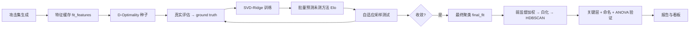

# 攻击特征与聚类深度研究报告

> 版本：2026-07-27 · 对应代码基线：`c55b678`
> 范围：攻击方法的特征体系、测试期训练管线（D-Optimality + SVD-Ridge）、测试后聚类管线（弱监督 + 阻尼白化 + HDBSCAN + 簇效验证）、后验特征防泄漏审计。

---

## 1. 架构总览

整套系统围绕三条第一性原则构建，所有设计取舍都可回溯到这三条：

1. **先验度量，后验禁入**：聚类与预测的度量空间只使用先验特征（攻击文本自身可得的信息）。后验特征（机器如何回应）一律不进入任何距离计算与模型训练，只用于簇级画像与簇效验证。
2. **聚类后置**：聚类只在整个测试流程结束后运行。测试期间不存在任何"预聚类"——它既浪费算力又会把不成熟的结构强加给采样。
3. **矩阵化批处理**：未测方法的 Elo 预测从"逐方法距离计算"变为"一次矩阵乘法"（SVD-Ridge），训练成本只在 ground truth 变化时发生。



---

## 2. 攻击特征体系

特征提取入口：`llmsec/clustering/features.py: extract_all_features()`，输出 `{method: {textual, embedding, technique, intent, defense, cross_model}}` 六块。**前五块中的四块 + prior 参与度量；defense 与 cross_model 不参与**（见第 5 章审计表）。

### 2.1 textual — 文本结构统计（12 维）

`features.py: TEXTUAL_RULES`（提取前先用 `strip_math_tax` 剥掉数学题越狱税尾巴）：

| 维度 | 含义 |
|---|---|
| `char_count` / `token_count` | 字符数 / tiktoken 估算 token 数 |
| `sentence_count` / `avg_sentence_len` | 句子数 / 平均句长 |
| `special_char_ratio` / `markdown_ratio` | 特殊符号占比 / Markdown 符号占比 |
| `non_latin_ratio` | 非 ASCII 字符占比（多语言/混淆信号） |
| `has_base64` / `has_hex` | 是否含 Base64 / Hex 编码块 |
| `has_multilingual` | 是否多语言混杂 |
| `has_roleplay` | 是否含角色扮演指令 |
| `has_output_format_control` | 是否含输出格式控制（"只输出""不要道歉"等） |

### 2.2 embedding — 语义向量（PCA 降维）

双路径（`features.py: extract_text_embeddings`）：

- **在线**：`all-MiniLM-L6-v2`（sentence-transformers）编码 → PCA 降到 `min(50, n//3, n-1)` 维；
- **离线降级**：HF 不可达时自动切 TF-IDF（200 维, 1-2gram）→ PCA 同维数。降级会显著削弱语义区分度（见第 7 章真实数据）。

### 2.3 technique — 攻击技术多标签（动态维数）

`features.py: TECHNIQUE_LABELS` 共 28 类正则规则（低资源语言、死语言、构造语言、方言、形似字符、零宽字符、代码切换、编码混淆、文档嵌入、代码注释注入、XML/JSON 逃逸、Markdown 注入、多轮污染、系统提示泄露、角色扮演、few-shot 强制、CoT 劫持、道德困境、权威冒充、输出格式控制、拒绝抑制、长度截断、分段编码、DAN 系、奶奶漏洞、学术伪装、情感勒索），外加 `harm:<类型>` 与 `cat:<类别>` 动态标签。二值向量。

### 2.4 intent — 意图与对抗强度（3 维）

`features.py: extract_intent_features`：`semantic_drift`（组内长度漂移代理）、`typo_ratio`（非常用字符占比）、`filler_ratio`（强制语气填充占比）。

### 2.5 prior — 名称先验（9 维，后补）

`llmsec/evaluation/elo_cluster.py: build_prior_features`——不需要任何评估即可从方法名/prompt 推导：方法名长度、分词数、变体后缀 one-hot（rot13/b64/code/story/数字）、是否含数学越狱税、prompt 行数 log。变体后缀是与 Elo 强相关的先验（同一攻击基底的 rot13 变体成功率往往相近）。

### 2.6 defense — 防御交互（14 维，**后验，禁入度量**）

`features.py: extract_defense_features`：judge 三维均值（harmfulness/specificity/dangerousness）、合规等级分布（A-E）、格式丧失率、状态分布（refused/irrelevant/complied）、平均响应长度、响应/prompt 长度比。无评估数据时为零向量。**它唯一的去向是簇画像均值与 CSV 导出**（第 5 章）。

### 2.7 cross_model — 跨模型指纹（占位）

空向量，预留多模型评估数据后启用。

---

## 3. 测试时如何训练（训练管线）

### 3.1 冷启动：特征缓存 + D-Optimality 种子

1. **特征缓存**（`ClusterEloPredictor.fit_features`）：对全部攻击方法提取特征写入 `cluster_artifacts.pkl`。注意这里**不做聚类**——它只是 ridge 与 D-optimal 的数据基础。攻击集不变（method_set_hash 相同）时整个跳过。
2. **D-Optimality 种子**（`llmsec/evaluation/active_learning.py`）：ground truth 为空时，我们不知道哪些方法值得花真金白银测。把问题形式化为最优实验设计：Ridge 的信息矩阵 `M = X_gtᵀX_gt + λI`，候选点 x 的预测方差（杠杆）为 `xᵀM⁻¹x`。贪心策略——反复选杠杆最大的点，选中后用 Sherman–Morrison 公式秩1更新：

   ```
   M⁻¹ ← M⁻¹ − (M⁻¹x xᵀM⁻¹) / (1 + xᵀM⁻¹x)        （精确，每次 O(d²)，无需重求逆）
   ```

   GT 为空时 M = λI，自动退化为"先挑特征空间中范数最大、最分散的点"，天然覆盖特征空间。种子数取 `max(5, ceil(log2 n))`。合成实测：D-optimal 种子最小 pairwise 距离 2.28 > 随机采样 20 次最优 1.73（`tests/test_whitened_tree.py`）。
3. 种子真实评估后写入 ground truth，进入训练循环。

### 3.2 SVD-Ridge 预测矩阵

`llmsec/evaluation/elo_cluster.py: EloPredictorModel`：

- **特征矩阵**：GT 方法的 `textual+embedding+technique+intent+prior` 五块拼接（`BLOCK_ORDER`，块间维度不一致零填充；预测时严格按训练 block_dims 截断/填充，杜绝静默失败）。
- **标准化 + 截距**：X 逐列 Z-score；**y 中心化存 `y_mean`**——这是修复过的严重 bug：X 各列零均值时 `Xw` 无法表达 ~1500 的 Elo 基准，曾导致预测均值 ≈ 0、σ² ≈ mean(y)²。修复后预测均值 1492 vs 真实 1485，λ* 从顶格 1000 回落。
- **SVD 解法**：`X = UΣVᵀ`，`w(λ) = V·diag(σᵢ/(σᵢ²+λ))·Uᵀy_c`（近零奇异值截断）。
- **λ 选择**：K-Fold（K=5）在 `logspace(-3, 4, 24)` 上选 CV 误差最小者；σ² 取 λ* 的 CV 残差（out-of-sample 估计，比训练残差诚实）。
- **模型缓存三级**（`_predict_batch_svd_ridge`）：
  - GT 指纹哈希未变 → 直接复用 w，纯矩阵乘法；
  - GT 增长 < threshold(10) → 用现有 λ* 单次 SVD 快速 refit（σ² 保留上次 CV 值，避免 in-sample 残差趋 0 的假自信）；
  - GT 增长 ≥ threshold → 重跑 K-Fold 选 λ。
- **MAP 不确定性**：Ridge 等价于高斯先验贝叶斯 MAP，预测均值 `E = y_mean + X_test·w`，方差 `σ²·diag(X_test (XᵀX+λI)⁻¹ X_testᵀ)`，输出 95% CI 并持久化到 `state.json: attacker_pred_std`。CI 宽的预测会在看板上显示为低置信徽标。

### 3.3 批量注入与自适应采样

- `_inject_predicted_elos`：一次 `predict_batch` 前向传播给全部未测方法注入预测 Elo（ground truth 不足 `min_cluster_size` 时回退同后缀/同基底变体平均）。
- 采样器（默认 hybrid）：前 R 轮 InfoGain（gap + α·不确定性 + β·簇访问计数 − γ·成功率），后接 Coordinate（簇坐标轮询，簇耗尽时从全局按 gap 补足——修复过 1~2 条退化批次）。聚类后置后采样器不依赖簇结构（簇信息为空时退化为全局 gap 排序）。
- **抗假阳性收敛**（`elo.py: check_convergence / compute_security_boundary`）：收敛要求 std、相对 std、覆盖率、轮次四条件同时满足；轮次不足时单点 std 按阈值保守取值（若取 0，std/rel_std 两项满分会让第一轮就以 0.82 置信度假收敛），置信度按 `n_rounds/window` 折扣。权重：绝对 std 0.30 + 相对 std 0.35 + 覆盖率 0.20 + 轮次 0.15，封顶 0.99。

---

## 4. 攻击完后如何聚类（post-test 管线）

入口：`ClusterEloPredictor.final_fit(records, eval_results)` → `llmsec/clustering/hdb.py: run_hdbscan_clustering`。

### 4.1 弱监督特征加权（相同机器反应拉近）

`llmsec/clustering/posterior.py: learn_supervised_weights`：

```
w_j = |pearson(X_j, y)|   → 归一到均值 1 → clip [0.2, 5] → 再归一
```

- y = 每个已测方法的真实反应（mean eval_score）。
- **只在 ground truth 上计算**——未测方法的 ridge 预测值若参与，特征会与自己的预测自相关（ridge 预测本身就是这些特征的线性组合），权重虚高。这是刻意防的循环论证。
- 加权在标准化之前逐列乘回：与机器反应相关的方向被放大（合成实测相关特征 2.9× vs 噪声 0.37×），相同反应的点在度量中自然拉近。

### 4.2 阻尼白化（轻量马氏距离）

`llmsec/clustering/space.py: build_whitened_space`：

```
X_std → SVD: UΣVᵀ → 取前 k 个主成分 → coords = U_k · scaleᵢ
scaleᵢ = (σᵢ/√n)^(1−damp) · (√n·σᵢ/√(σᵢ²+λw))^damp        damp=0.5
```

- **为什么不全白化**：全白化（damp=1，严格马氏）把每个主成分方向都拉成单位方差——谱平滑时噪声平台（σ²≈0.57）被放大到与信号（σ²≈4）几乎同权重，实测把 6 团簇数据的 auto-k 从 6 拉到 11、簇碎裂。damp=0.5 的几何插值保留信噪比同时获得大部分度量校正。
- **λw 取谱拐点**：`log σ²` 序列上距首尾弦最远的点 `_spectral_knee`，拐点后视为噪声平台。
- **降维不需要白化前单独做**：预 PCA 与白化内 SVD 截断是同一线性操作。真正要调的是截断位置——`n_dims = min(95%方差维数, 谱拐点×2, 50)`，噪声尾硬截断。

### 4.3 双树分工：HDBSCAN 密度视图 + Ward 缩放树

实测教训（132 方法真实数据）：HDBSCAN 的 `single_linkage_tree_` 在最近邻链式合并下产出 **127/132 单簇 + 单点**的退化切割——缩放树完全失效，一个巨型簇霸占 97% 方法，其余簇已测成员不足 2 个，ANOVA 直接"有效簇不足"拒检。因此改为双树分工：

- **密度视图（HDBSCAN flat）**：`HDBSCAN(min_cluster_size=max(3, n//40), min_samples=1, eom)` 在白化坐标上产出 flat labels——若干紧密密度簇 + 如实标记的"稀疏区（低密度噪声）"。`min_samples=1` 放宽互达距离，是集中空间里把噪声率从 ~76% 降到 ~67% 的关键参数（6 组参数实测对比）。
- **缩放树（Ward linkage）**：同一白化坐标上的 Ward 层次树存入 artifacts——缩放/关键层/簇效分析全部在这棵树上。Ward 实测 k*=10 时分布 [54, 41, 17, 5, 5, 5, 2, 1]，均衡可用。主 labels（报告 method_labels、簇级安全分析、看板）= 关键层 k* 的 Ward 切割。
- **为什么不从 HDBSCAN condensed tree 切层**：`to_numpy()` 只有 (parent, child, λ, child_size) 四元组，"切走后留在父簇的点"的身份不可枚举，精确还原 k 层成员需额外追踪 MST 与逐点归属，代码量大且脆弱。

**关键层 auto-k**（`llmsec/clustering/tree.py`，算法无关工具）：候选 k 以 `k0 = clamp(ceil(log2 n), 4, 20)`（log 增长：n=100→7，n=1000→10）为中心 log 间隔取点；每个 k 切树后计算轮廓系数、Calinski-Harabasz（方差比）、DB 指数，归一化（DB 取反）合成 S(k)，**全局 argmax** 选关键层；若 argmax 落在最大候选且末尾仍上升，标注"k 可能被低估"。保留 top-3 k 作为前端缩放预设停点。
  - *被否决的规则*：首个平缓点即停。真实数据上小 k 端非单调抖动让它在第 1 步就触发，把主峰 k=12 误判成 k=6（sweep 实测：6→0.409, 7→0.405, 8→0.396, …, 12→0.585）。
- **命名**（`pipeline.py: auto_name_clusters`）：关键层各簇与密度簇分别命名（簇内最多技术标签 → 最多 harm_type → TF-IDF 关键词（剔除 base64/rot13 乱码 token）→ 小簇/单点簇用代表方法名兜底）；噪声组固定命名"稀疏区（低密度噪声）"。
- **簇效验证对象 = 关键层切割**（flat 密度视图小簇已测成员不足时无法检验，关键层的均衡分组保证每簇足够的已测样本）。

### 4.4 簇效验证（ANOVA / Kruskal-Wallis）

`posterior.reaction_validation`——这是回答"我们的特征到底有没有抓住机器在意的东西"的检验：

- 只用真实 GT：各簇已测方法的 mean eval_score；
- `f_oneway`（ANOVA）+ `kruskal`（非参数兜底），附效应量 eta²（ANOVA）/ ε²（KW）——只报 p 会误导，小效应量的"显著"没有实际意义；
- 三级判定：
  - p<0.05 且效应量 >0.1 → "特征有效：不同簇的机器反应差异显著"；
  - 显著但效应量小 → "仅弱相关，特征抽象有提升空间"；
  - 不显著 → "特征抓到的文本结构与该机器关心的不相关，特征抽象需升级"。
- 全部后验统计集中在 `posterior.py`（唯一接触 eval 结果的模块），聚类主流程保持纯净（点5 的代码卫生）。

---

## 5. 后验特征防泄漏审计表

审计基线 `c55b678`，逐路径核实 defense（后验）特征去向：

| 路径 | 拦截点 | 状态 |
|---|---|---|
| 聚类度量（白化空间/HDBSCAN） | `space.py:23` `PRIOR_BLOCKS = (textual, embedding, technique, intent, prior)` | ✅ 不含 defense |
| SVD-Ridge 训练/预测 | `elo_cluster.py:63` `BLOCK_ORDER = (textual, embedding, technique, intent, prior)` | ✅ 不含 defense |
| 弱监督权重学习 | `final_fit` / `cli.py:85` 调 `build_feature_matrix`（默认先验块） | ✅ 不含 defense |
| 前端 PCA/t-SNE 投影 | `dashboard_api.py:360` `_PROJECTION_BLOCKS` | ✅ 不含 defense |
| 特征矩阵其余调用点 | `space.py:113/174`、`elo_cluster.py:751` | ✅ 均默认先验块 |

defense 仅存留于四个**非度量**位置（设计允许）：

1. `features.py:513` 提取并存入 features dict / artifacts（数据保留）；
2. `pipeline.py:193` `build_cluster_profiles` 的簇级 defense 均值（后验画像展示）；
3. `pipeline.py:231` `_export_matrix` CSV 导出列；
4. `elo_cluster.py:875` 未测方法零填充（占位，从不被度量读取）。

**结论：无泄漏。** defense 处于"存储但不用"状态，与"后验只画像与验证"的架构约定一致。

---

## 6. 数据流全景

| 阶段 | 输入 | 产物文件 | 消费方 |
|---|---|---|---|
| 攻击生成 | 攻击分析.md / HarmBench | `output/attacks/*.jsonl` | runner |
| 特征缓存 | 攻击集 | `cluster_artifacts.pkl`（features/meta） | ridge、D-optimal |
| 训练/预测 | GT + 特征 | `state/state.json`（ratings、ground_truth、attacker_pred_std） | 采样器、看板 |
| 测试循环 | 采样批次 | `runs/<ts>/attack_results.jsonl`、`sampler_log.jsonl` | 报告、最终聚类 |
| 最终聚类 | 全部 records + results | `cluster_report.json`、`cluster_artifacts.pkl`（labels/linkage/coords/sweep/reaction_validation）、`cluster_matrix.csv` | 看板、cluster_analysis |
| 簇级分析 | tracker + 聚类产物 | `runs/<ts>/cluster_security_analysis.json` | 看板 |
| 综合报告 | 全部产物 | `runner_report.json`、`security_tree.json`、`security_report.md` | 用户 |

---

## 7. 真实运行数据与已知局限

### 7.1 最近一次完整运行（2026-07-27，harmbench_ensemble，PCAP Judge Qwen3.5-9B）

- 132 种方法、150 条 prompt；离线 TF-IDF 降级（HF 不可达）。
- 8 个 D-optimal 种子 → 18 轮收敛（61/132 已测，ASR 32.8%，FPR 12.5%，边界 ELO 1534，判定 BROKEN）。
- 最终聚类：9 簇 + 89 噪声（67%），关键层 k*=16（top3 [8, 13, 16]）。
- **簇效验证：p_anova=0.20、eta²=0.01 → "特征抓到的文本结构与该机器关心的不相关，特征抽象需升级"。**

### 7.2 TF-IDF vs 语义 embedding 对照实验（同日，同一数据）

embedding 通道修复后（hf-mirror 镜像 + 本地缓存），用 sentence-transformers 重跑同一数据：

| 指标 | TF-IDF 降级 | 语义 embedding | 变化 |
|---|---|---|---|
| 簇数 / 噪声率 | 9 簇 / 67% | 6 簇 / 80% | 噪声率↑（见解读） |
| 关键层 k* | 16 | 6 | 结构更干净 |
| silhouette | ~0.05 | **0.3756** | ↑ 约 7 倍 |
| p_anova | 0.198 | **0.053** | 逼近显著线 |
| eta² | 0.012 | **0.151** | ↑ 一个数量级，达中等效应量 |

**解读**：
- 语义 embedding 让簇结构质量（silhouette）和簇-反应相关性（eta²）提升了一个量级——证实 embedding 质量就是此前 ANOVA 不显著的主要瓶颈，而非特征体系设计错误。
- 噪声率上升是如实反映而非退步：语义空间里少数主题簇更紧实，长尾攻击方法在语义上确实互不相干，被诚实地标记为稀疏区（且 20% 的点形成了 0.38 轮廓系数的 6 个高质量簇）。
- p=0.053 卡在显著线边缘：更大更强的 embedding（如 API embedding 或更大模型）有望跨过 0.05。

### 7.2' 局限（诚实清单）

1. ~~TF-IDF 降级是最大瓶颈~~（**已解决**，2026-07-27）：embedding 四层降级链（本地缓存 → hf-mirror 镜像 → API embedding → TF-IDF）+ 本地缓存优先修复，模型经镜像下载后离线可用。对照实验见 7.2。
2. **λ* 跨重训波动**（0.033→0.001→9.05→4.49）：GT 从 8 长到 60+ 的成长期正常现象，σ² 同步收敛到 ~350-445。
3. **家族相关批次的收敛混叠**：采样按簇轮询导致整轮 rot13/整轮 code 交替，3 轮收敛窗口可能在被同源批次"稳定"时提前触发（本次 46% 覆盖收敛，但最终判定仍合理）。可选对策：窗口 3→5。
4. **集中空间的密度上限**：白化坐标 p90/p10 距离比仅 ~2.1，密度聚类（无论 DBSCAN 还是 HDBSCAN）在此类空间的噪声率有下限；多层结构请以前端树图缩放（关键层切割）为准，flat labels 是基础视图。

### 7.3 改进方向

1. 更强的 embedding：API embedding（DashScope/智谱等，企业网直连）或更大模型，有望把 p_anova 从 0.053 推过显著线；
2. 若 ANOVA 在更强 embedding 下仍不显著，则是特征抽象本身的答案：把反应相关信号（judge 维度、响应行为）做成半监督 embedding 目标，或引入对比学习训练"反应感知"的文本编码器；
3. 收敛窗口与家族混叠：batch 内强制后缀/家族多样化，或窗口调至 5。

---

*报告结束。如有与代码不一致之处，以代码为准（基线见文首）。*
