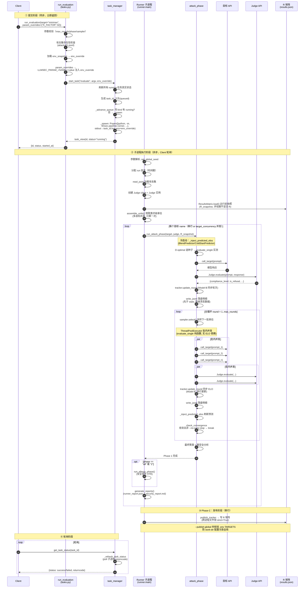
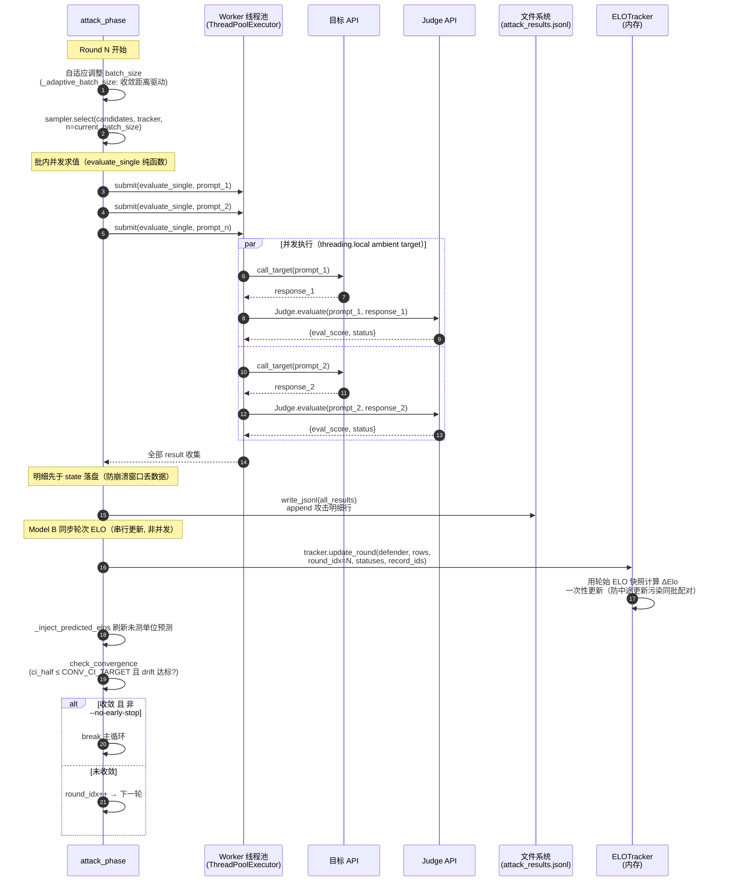
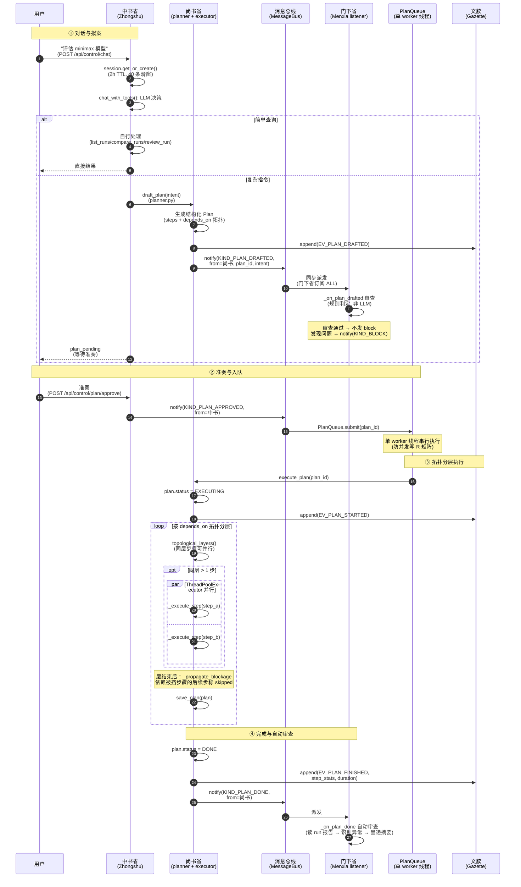
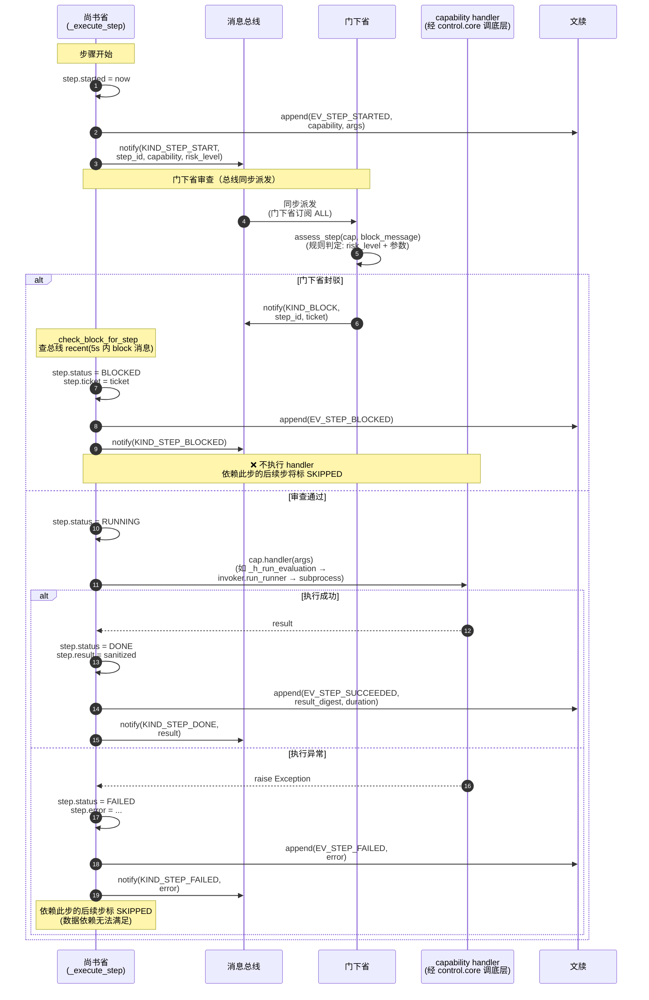
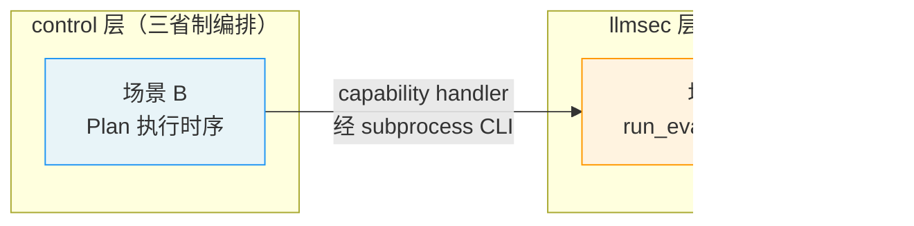

# 核心业务时序图

> **对应代码版本**：2026-08 收尾阶段（`main` 分支）
> **图表格式**：Mermaid `sequenceDiagram`（GitHub / VSCode 原生渲染）
> **阅读顺序**：建议先读"参与者说明"和"核心设计决策"，再看时序图。每个图配完整主线时序 + 异常分支 + 批注。

本文档覆盖 llmsec 两个最核心的业务场景：
- [场景 A：`run_evaluation` 异步评测完整时序](#场景-arun_evaluation-异步评测完整时序)
- [场景 B：三省制 Plan 执行时序](#场景-b三省制-plan-执行时序)

---

## 目录

- [场景 A：run_evaluation 异步评测](#场景-arun_evaluation-异步评测完整时序)
  - [A.1 参与者说明](#a1-参与者说明)
  - [A.2 完整时序图](#a2-完整时序图)
  - [A.3 attack_phase 主循环详图](#a3-attack_phase-主循环详图)
  - [A.4 核心设计决策](#a4-核心设计决策)
- [场景 B：三省制 Plan 执行](#场景-b三省制-plan-执行时序)
  - [B.1 参与者说明](#b1-参与者说明)
  - [B.2 完整时序图](#b2-完整时序图)
  - [B.3 单步执行详图（封驳机制）](#b3-单步执行详图封驳机制)
  - [B.4 核心设计决策](#b4-核心设计决策)

---

## 场景 A：`run_evaluation` 异步评测完整时序

这是 llmsec 最核心的流程：从 Agent 调用 `run_evaluation` 提交任务，到自适应攻击流水线完成、结果写入 R 矩阵的全链路。

### A.1 参与者说明

| 参与者 | 代码位置 | 职责 |
|--------|----------|------|
| **Client** | 外部 Agent / MCP Client | 调用工具、轮询状态 |
| **run_evaluation** | `llmsec/mcp/tools/tasks.py:78` | 参数校验、env_snapshot/param_overrides 注入、构造 argv |
| **task_manager** | `llmsec/server/task_manager.py` | 子进程任务队列（按 kind FIFO 串行）、spawn、状态刷新 |
| **Runner** | `llmsec/pipeline/runner.py:117` (`main`) | 子进程：评估流水线编排 |
| **attack_phase** | `llmsec/pipeline/attack_phase.py:278` | Phase 1 自适应攻击核心循环 |
| **目标 API** | `llmsec/targets/` | 被测目标模型（OpenAI/PCAP/本地 sim） |
| **Judge API** | `llmsec/evaluation/judge.py:235` | LLM-as-Judge 评分（带重试） |
| **R 矩阵** | `output/state/results.json` | 唯一真相（跨进程文件锁） |

### A.2 完整时序图

### A.3 attack_phase 主循环详图

上图 Step ② 中 attack_phase 的主循环是评估的核心。放大展示一轮内部的细节：

### A.4 核心设计决策

> 以下批注解释时序图中"为什么这样设计"，是理解 llmsec 的关键。

**① 批内并发 vs ELO 串行更新的交替**

attack_phase 的核心矛盾：求值是纯函数（无 ELO 依赖）适合并发，但 ELO 更新必须串行（Model B 同步轮次）。解决方案：
- `evaluate_single` 用 `ThreadPoolExecutor` 并发（纯函数，无共享状态）
- ELO 更新在所有并发求值**收集完后**由主线程**串行**执行（`tracker.update_round`）
- 用轮始 ELO 快照计算 ΔElo，一次性更新——防止同批内中途更新污染配对计算

**② api_error 不污染 ELO**

`result["status"] == "api_error"` 时（断网/超时等）：不更新 ELO、不记结果，单位保持未测状态以便下轮重试。这避免了"网络抖动导致模型安全评分虚高"。

**③ 先落盘明细再写 state**

每轮 `write_jsonl(attack_file, all_results)` 在 `tracker` 更新/落盘**之前**执行。这样即使进程在落盘窗口崩溃，已观测的攻击明细也不会丢失（state 可从明细重建，反之不行）。

**④ R_snapshot 快照隔离**

评估期不读活 R（其他并发评估可能在同时写），而是运行前 `ResultsMatrix.load()` 快照一份 `R_snapshot`。评估结束后 Phase C 由主线程串行 publish，避免并发写冲突。

**⑤ --publish-global 校验 .env TARGETS**

work-dir 隔离模式下若误带 `--publish-global`，会把 work-dir 的配置污染到全局。代码校验 `--publish-global` 时 `.env TARGETS` 是否匹配，不匹配则拒绝写入。

**⑥ 多目标 ambient target**

并发多目标时用 `threading.local` 保证每个 worker 线程的 `set_active_target` 独立，防止多目标路由串扰（A 模型的请求发到 B 的端点）。

---

## 场景 B：三省制 Plan 执行时序

这是 control 层（元控制 / Agent 中间者）的核心流程：用户用中文指令编排 llmsec，经"中书省规划 → 门下省审查 → 尚书省执行"的三省制管线完成多步任务。

### B.1 参与者说明

| 参与者 | 代码位置 | 职责 |
|--------|----------|------|
| **用户** | — | 输入指令、准奏/驳回 |
| **中书省** (Zhongshu) | `control/agent/zhongshu/dialogue.py` | 对话入口、简单查询自处理、复杂指令转尚书省拟案 |
| **尚书省** (Shangshu) | `control/agent/shangshu/` | 拟案（planner）、执行（executor）、能力清单（capabilities） |
| **门下省** (Menxia) | `control/agent/menxia/listener.py` | 订阅总线、审查 Plan/Step、发封驳令 |
| **总线** (Bus) | `control/agent/bus.py` | 进程内消息总线（三省不直接互调） |
| **PlanQueue** | `control/agent/shangshu/queue.py` | 单 worker 线程串行执行 Plan（共享 R 矩阵） |
| **文牍** (Gazette) | `control/agent/gazette.py` | 执行历史持久化（`output/gazette/<plan_id>.jsonl`） |

### B.2 完整时序图

### B.3 单步执行详图（封驳机制）

上图 Step ③ 中每个 `_execute_step` 是三省制安全管线的核心——门下省在每步执行前审查，可随时封驳。放大展示：

**封驳传播**（`_propagate_blockage`）：每层执行完后，检查哪些步 BLOCKED 或 FAILED，依赖它们的后续步骤标 `SKIPPED`（不依赖的继续）。用户可事后通过 `POST /api/control/plan/block/approve` 放行封驳的步骤——若 Plan 已 done，放行后会自动重新提交执行队列。

### B.4 核心设计决策

> 以下批注解释三省制架构的关键设计。

**① 三省不直接互调——全经消息总线**

中书省、尚书省、门下省之间**没有任何直接函数调用**，所有通信经 `control/agent/bus.py:MessageBus`。这避免了循环依赖（门下省审查尚书省的步骤，若直接调用会形成环）。总线是进程内单例，`Lock` 保护，最近 500 条留存内存供前端 `/api/control/bus/feed` 补全。

**② 总线同步串行派发 + 回调异常不中断**

`bus.publish(msg)` 同步串行调用所有匹配订阅者的回调（一个消息的所有订阅者依次执行）。回调内异常用 `try/except` 捕获，记录到 stderr 但**不中断后续派发**。这保证了门下省审查异常不会阻塞尚书省的执行。

**③ 门下省是订阅者，不是被动函数**

门下省"常态挂起，监听三省所有内容"。它订阅 `KIND_PLAN_DRAFTED`、`KIND_STEP_START`、`KIND_PLAN_DONE` 等事件，在事件发生时被动触发审查。尚书省不需要知道门下省是否存在（解耦）。

**④ Plan 串行队列——防并发写 R 矩阵**

`PlanQueue` 用单 worker daemon 线程 + `threading.Condition` 串行执行 Plan。同一时间只跑一个 Plan，因为它们共享同一个 R 矩阵（`output/state/results.json`）。并发写会导致数据竞争。

**⑤ 拓扑分层 + 同层并行**

Plan 的步骤有 `depends_on` 依赖关系。`topological_layers()` 按依赖分层：
- 同层步骤无依赖，可用 `ThreadPoolExecutor` 并行执行
- 层间严格顺序（上层全部完成后才进入下层）
- 层结束后 `_propagate_blockage` 传播 BLOCKED/FAILED

**⑥ 文牍持久化——完整执行历史**

每个事件（plan_started/step_started/step_succeeded/step_blocked/step_failed/plan_finished）都 append 到 `output/gazette/<plan_id>.jsonl`。这是审计和调试的真相源——即使进程崩溃，文牍也记录了执行到哪里。`get_plan_context` 和 `read_plan_events` 工具可从文牍重建任意 Plan 的完整执行时间线。

**⑦ 封驳的用户闭环**

封驳不是终态——用户可以事后放行：
1. 门下省发 `KIND_BLOCK` + ticket
2. 步骤标 `BLOCKED`，出现在 `GET /api/control/blocks`
3. 用户审阅后 `POST /api/control/plan/block/approve`
4. 若 Plan 已 done，自动重新提交执行队列（`step.status` 从 BLOCKED 重置为 PENDING）
5. 用户也可 `POST /api/control/plan/reject` 直接驳回整个 Plan（同时清除所有封驳）

---

## 附：两图的关系

场景 B 是**编排层**：用户用中文指令 → 三省制管线生成并执行 Plan。Plan 的某个 step 的 capability handler（如 `_h_run_evaluation`）会经 `control.core.invoker.run_runner` 起 subprocess 调用 `llmsec.pipeline.runner`——这正是场景 A 的入口。

关键约束：**control 层绝不 import llmsec 内部**，只经 subprocess CLI + 文件交互。这保证了两层可独立演进、独立测试。
